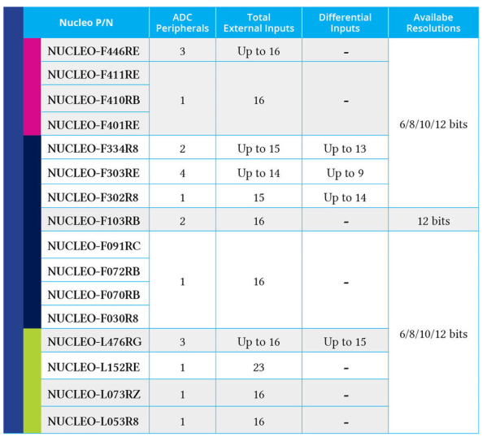
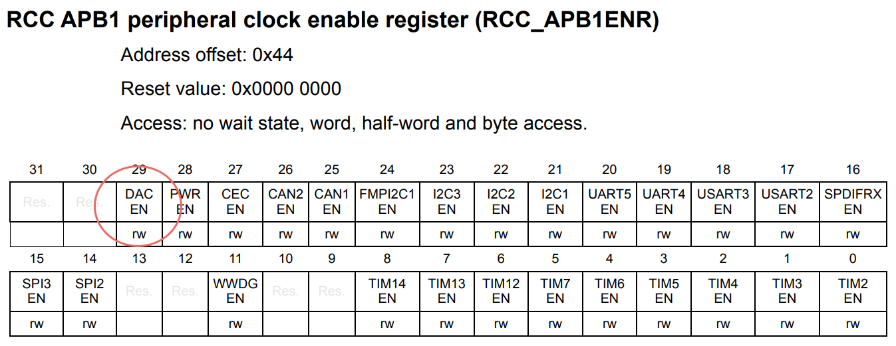
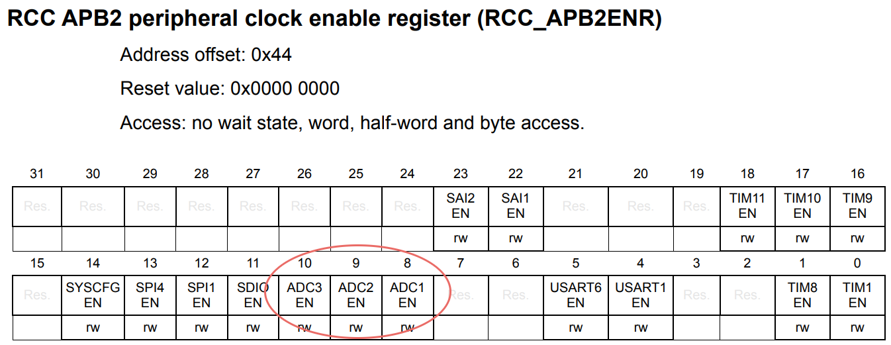
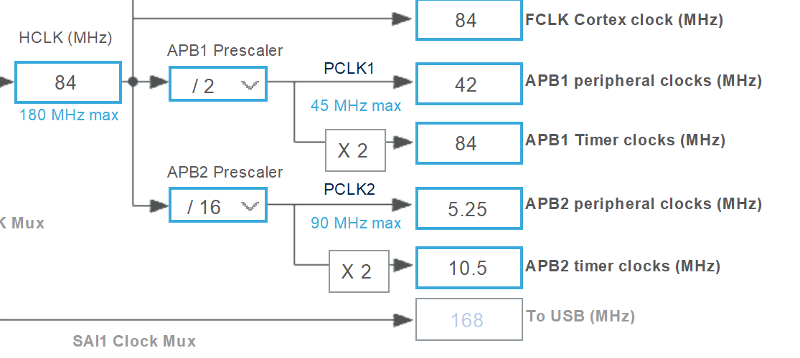
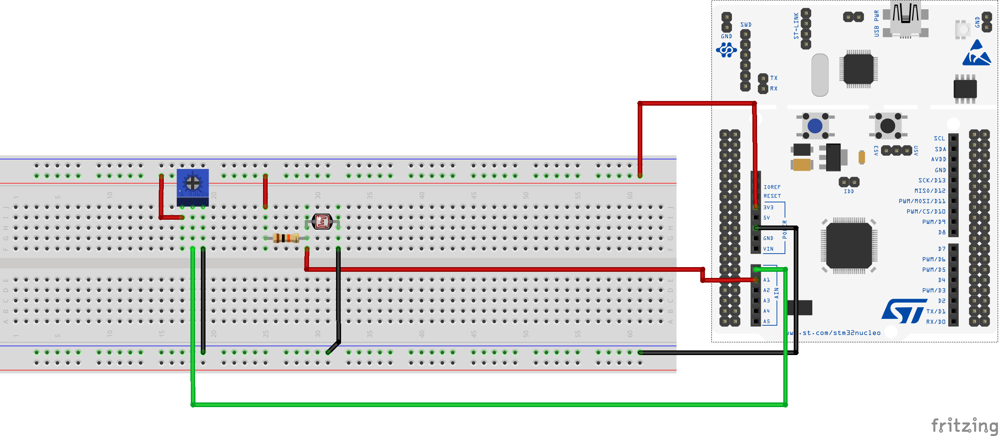

# ANALOG I/O

</br>

## Overview
In this lesson we will create different applications in order to show how the peripherals interfacing with analog signals work. This is an important topic, in fact, every signal, when inside an MCU, must necessarily be understood as digital values that we want to perform algorithmic operations.

We will use *STM32Cube* to perform Analog-Digital conversion operations that are slightly more complex, from an implementation point of view, if compared to simple digital I/O operations.

## Theoretical aspects

### Analog-to-Digital-Converter (ADC)
It is a device capable of converting an analog signal, continuous over time, into a series of discrete values. The output value is determined starting from the input voltage value, compared with a fixed reference voltage value, according to the formula

<p align="center">
    
</p>

The *resolution* in terms of voltage is determined from the *bit resolution* of the **ADC**, which defines the available quantization levels. On the Nucleo-F446RE MCU there is an **ADC** with _12-bit resolution_, therefore 4096 (= 2¹²) quantization levels, which correspond to 4096 possible distinguishable outputs. The reference voltage is equal to 3.3V, consequently the resolution in terms of voltage is 0.81mV (=3.3V/4096).


So, for example, if the input voltage is equal to 1V, the **ADC** will generate an output digital value equal to 1250 (1/0.00080) which is equivalent to the binary number **010011100010** (12-bit); while for an input voltage equal to 3V, the conversion to digital will produce the value 3750 (3/0.00080) which is equivalent to the binary value **111010100110**.

Note that the higher the resolution, the lower the number of possible conversions in the same time interval; in applications where "response speed" is not crucial, use the highest possible resolution.

### **D**igital-to-**A**nalog-**C**onverter (**DAC**)
It is a device that converts a digital signal into an analog one: it accepts as an input a finite precision value (generally expressed as a binary number) and outputs an analog voltage signal determined as follows on the basis of a reference voltage:

<p align="center">
    
</p>

Also for this device it is possible to determine a _resolution_ (in bits or in terms of voltage) as for an **ADC**. The concepts behind this peripheral are very similar to those analyzed so far.

### ADC/DAC and STM32

In the *STM32* devices, the conversion offered by the **ADC** is provided by a **SAR** (**S**uccessive **A**pproximation **R**egister) structure and can operate in different modalities: *single mode*, *continuous mode*, *scan mode*.

These modalities, and the entire structure, can be used according to three main logics, identified as:
- *polling mode*
- *interrupt mode*
- *DMA mode*

The results obtained are always stored in a 16-bit register whose bits inside may be aligned to the left (*left-aligned*) or to the right (*right-aligned*).

It should also be noted that, generally, the **ADC** implements particular functions to start the conversion of analog values based on the recognition of particular voltage values used as thresholds, defined by the programmer.

The microcontroller used in this tutorial provides a 12-bit **ADC**, which communicate with the outside via 16 different channels. 

<p align="center">
    
</p>

For what concern the **DAC**, the microcontroller has a 12-bit **DAC** (if more are available, they can also be used simultaneously). In addition to this, other main features are: the possibility to use 8, 10 or 12 bits; the possibility to exploit external *triggers* and the possibility of management via **DMA**.

## Registers related to ADC and DAC

Like other peripherals, **ADC** and **DAC** are also managed by appropriately configuring registers, or otherwise using structures and functions exported from the **HAL** driver. The complete management through the latter hides to the programmer a whole series of configurations that are generally necessary for the use of an **ADC** or a **DAC**, starting from the choice of the system clock and then continue with:
* Enable clock on peripheral (**ADC/DAC**)
* Enabling the clock and enabling the **GPIO** that you want to use to externalize the peripheral
* Configuration of the acquisition/generation speed by setting appropriate prescalars of the system clock
* Other aspects related to resolution configuration, any external trigger, use of *DMA*, etc;

The clock configuration for the **ADC** device is done through the `APB2ENR` register of RCC while the **DAC** instead is attached to` APB1ENR`.

<p align="center">
    
    
</p>

Below it is reported some of the main registers used to configure and utilize both **DAC** and **ADC**. For more information please refer to the [Reference Manual](https://www.st.com/resource/en/reference_manual/dm00135183-stm32f446xx-advanced-arm-based-32-bit-mcus-stmicroelectronics.pdf).

* **DAC** control register (**DAC_CR**)

    Configuring this register allows to enable/disable DAC channels, set output type, enable DMA support and more.

* **DAC** software trigger register (**DAC_SWTRIGR**)
  
    The bits in this register allows to enable/disable the software trigger for the two channels.
    
   * 0: Software trigger disabled
   * 1: Software trigger enabled
    
* **DAC** channel 1/2 8/12-bit right-aligned data holding register
(**DAC_DHRxRy**), *x = 8,12; y = 1,2*
    
    These bits are written by software which specify *x*-bit data for DAC channel *y*.

* **DAC** channel 1/2 8/12-bit left-aligned data holding register
(**DAC_DHRxLy**), *x = 8,12; y = 1,2*

     These bits are written by software which specify *x*-bit data for DAC channel *y*.

* **ADC** control register x (**ADC_CRx**), *x = 1,2;*

    Configuring this register allows to enable/disable ADC channels, set resolution, set continuous/discontinuous mode, configure scan mode, set data alignment and more.

* **ADC** regular sequence register *x* (**ADC_SQRx**), *x = 1,2,3;*

    These bits are written by software to define the total number of conversions in the regular channel conversion sequence and manage the channels.

* **ADC** regular data register (**ADC_DR**)

    These bits are read-only. They contain the conversion result from the regular channels. The data are left- or right-aligned.


## Analog I/O and STM32Cube
### DAC use case

Probably the simplest application to test the operation of a **DAC** is to generate analog signals at a fixed voltage. To implement this application, the previously illustrated registers are used, also initializing the pin to be used for the analogue output: on the board used, one of the two pins capable of carrying out this purpose is pin 4 of port A (**PA_4**).

The main program executes, in its infinite life cycle, the commands to bring to the output a voltage value that varies from 0V to 3.3V, with 5ms of delay between different values. Obviously, to evaluate the correct functioning of the **DAC** it is necessary to connect the pin **PA_4** to an oscilloscope.
 
```c
int main(void){
    /* MCU Configuration--------------------------------------------------------*/

    /* Reset of all peripherals, Initializes the Flash interface and the Systick. */
    HAL_Init();

    /* Configure the system clock */
    SystemClock_Config();

    uint32_t dac_value;

    // Abilitazione GPIOA (bit 0)
    RCC->AHB1ENR |= RCC_AHB1ENR_GPIOAEN;

    // GPIOA4 : Analog mode
    GPIOA->MODER &= ~(0x03 << 8);
    GPIOA->MODER |= 0x00000300; // Set pin 4 in Analog Mode

    // Abilitazione DAC (bit 29 di APB1ENR)
    RCC->APB1ENR |= RCC_APB1ENR_DACEN;

    // Configurazione DAC tramite control register
    DAC->CR |= (0x01 << 0); // enable DAC channel 1
    DAC->CR |= (0x00 << 1); // enable DAC ch1 output buffer
    DAC->CR |= (0x01 << 2); // enable Trigger
    DAC->CR |= (0x07 << 3); // choose Software Trigger as source (0b111)

    // set output to Vref * (dac_value/0xFFF)
    DAC->DHR12R1 = dac_value;
    DAC->SWTRIGR |= (0x01 << 0); // trigger ch1

    while(1){
        for(dac_value = 0x00; dac_value < 0xFFF; dac_value += 0x010) {
            DAC->DHR12R1 = dac_value;
            DAC->SWTRIGR |= (1 << 0 ); // trigger ch1
            HAL_Delay(5);
        }
    }


}
```
This application generates a *sawtooth* wave, with a period of 50ms and a delay of 5ms between each step. The output of the **DAC** should be evaluated with an oscilloscope; the analysis should return a graph like this:

<p align="center">
    
</p>

### ADC use case

The typical usage of the **ADC** is to read an external analog signal generated by external analog component, such as potentiometers or analog sensors. Following these simple steps it is possible to develop simple applications able to acquire and process analog signals.

Below is reported an example where data is acquired from a rotary potentiometer connected to the board as shown in the image; the potentiometer output is connected to the analog input on pin 0 of port A (**PA_0**).

<p align="center">
    
</p>

The logic behind the potentiometer is standard and reported in the figure below.

<p align="center">
    
</p>

In this case the registers indicated above are used to structure, in the `main()`, a code that acquires the values recorded on the output line of the potentiometer. The ADC is configured in *single mode* and the acquisition of the converted value follows a polling approach.
The output value can be checked using the debug interface of the development environment.

```c
/* Private user code ---------------------------------------------------------*/
/* USER CODE BEGIN 0 */
#include <math.h>
#define ADC_FS 3.3f
volatile uint16_t voltage = 0;      // Store level of voltage
volatile float voltage_f = 0;       // Store converted voltage value
/* USER CODE END 0 */

/**
  * @brief  The application entry point.
  * @retval int
  */
int main(void)
{
  /* USER CODE BEGIN 1 */

  /* USER CODE END 1 */

  /* MCU Configuration--------------------------------------------------------*/

  /* Reset of all peripherals, Initializes the Flash interface and the Systick. */
  HAL_Init();

  /* USER CODE BEGIN Init */

  /* USER CODE END Init */

  /* Configure the system clock */
  SystemClock_Config();

  /* USER CODE BEGIN SysInit */

  /* USER CODE END SysInit */

  /* Initialize all configured peripherals */
  MX_GPIO_Init();
  MX_USART2_UART_Init();
  /* USER CODE BEGIN 2 */

  /* GPIO Configuration */
  // Provide clock to PORTA (PA_0 and PA_1 are associated to CH0 and CH1)
  RCC->AHB1ENR |= (1 << RCC_AHB1ENR_GPIOAEN_Pos); 	// Clock to GPIOA

  // Set both GPIOs in Analog mode
  GPIOA->MODER |= (3 << GPIO_MODER_MODE0_Pos);		    // Set PA0 in Analog mode

  /* ADC Configuration */
  // Provide clock to ADC1
  RCC->APB2ENR |= (1 << RCC_APB2ENR_ADC1EN_Pos); 	// Clock to ADC1


  ADC1->CR2 	|= (0x01 << ADC_CR2_ADON_Pos);			// (ADON) Power On ADC1
  ADC1->CR2 	&= ~(0x01 << ADC_CR2_CONT_Pos);			// (CONT) Single Conversion Mode
  ADC1->SQR3 	&= ~(0x1F << 0);						// Clear before Selection of Channel 0
  ADC1->SQR3 	|= (0x00 << 0);							// Selection of Channel 0
  ADC1->CR1 	&= ~(0x1 << ADC_CR1_SCAN_Pos); 			// (SCAN) Disable Scan Mode
  ADC1->CR1 	&= ~(0x1 << ADC_CR1_DISCEN_Pos); 		// (DISCEN) Disable Discontinuous Mode
  ADC1->CR1 	&= ~(0x07 << ADC_CR1_DISCNUM_Pos);		// (DISCNUM) Clear Number of Discontinuous Channels
  ADC1->CR2 	&= ~(0x1 << ADC_CR2_ALIGN_Pos); 		// (ALIGN) Align right
  ADC1->SMPR2 	&= ~(0x0F << ADC_SMPR2_SMP0_Pos);		// Set 3 Cycles per Samples
  ADC1->CR1 	&= ~(0x03 << ADC_CR1_RES_Pos);			// 12 Bit resolution
  ADC1->CR2 	|= (0x01 << ADC_CR2_EOCS_Pos); 			// (EOCS) Notify when each conversion of a sequence is complete

  // Start ADC1 conversion
  ADC1->CR2 |= (0x1 << ADC_CR2_SWSTART_Pos);

  /* USER CODE END 2 */

  /* Infinite loop */
  /* USER CODE BEGIN WHILE */
  while (1)
  {
    /* USER CODE END WHILE */

    /* USER CODE BEGIN 3 */
	  if((ADC1->SR >> ADC_SR_EOC_Pos) & 0x01) {
		  voltage = (uint16_t)ADC1->DR;
		  voltage_f = voltage*(ADC_FS/pow(2, 12));
		  ADC1->CR2 |= (0x1 << ADC_CR2_SWSTART_Pos);    // Restart conversion (Single Mode)
	  }

  }
  /* USER CODE END 3 */
}
```

The data acquisition can be also designed using an interrupt approach. This last method requires the configuration of the **NVIC** and the implementation of the ADC corresponding **ISR** (`void ADC_IRQHandler()`)

```c
/* Private user code ---------------------------------------------------------*/
/* USER CODE BEGIN 0 */
#include <math.h>
#define ADC_FS 3.3f

volatile uint16_t voltage = 0;
volatile float voltage_f = 0;
void ADC_IRQHandler() {
	if(((ADC1->SR >> ADC_SR_EOC_Pos) & 0x01)) {
		voltage = (uint16_t)ADC1->DR;
		voltage_f = voltage*(ADC_FS/pow(2, 12));
		ADC1->CR2 |= (0x1 << ADC_CR2_SWSTART_Pos);
	}
}
/* USER CODE END 0 */

/**
  * @brief  The application entry point.
  * @retval int
  */
int main(void)
{
  /* USER CODE BEGIN 1 */

  /* USER CODE END 1 */

  /* MCU Configuration--------------------------------------------------------*/

  /* Reset of all peripherals, Initializes the Flash interface and the Systick. */
  HAL_Init();

  /* USER CODE BEGIN Init */

  /* USER CODE END Init */

  /* Configure the system clock */
  SystemClock_Config();

  /* USER CODE BEGIN SysInit */

  /* USER CODE END SysInit */

  /* Initialize all configured peripherals */
  MX_GPIO_Init();
  MX_USART2_UART_Init();
  /* USER CODE BEGIN 2 */

  /* GPIO Configuration */
  // Provide clock to PORTA (PA_0 and PA_1 are associated to CH0 and CH1)
  RCC->AHB1ENR |= (1 << RCC_AHB1ENR_GPIOAEN_Pos); 	// Clock to GPIOA

  // Set both GPIOs in Analog mode
  GPIOA->MODER |= (3 << GPIO_MODER_MODE0_Pos);		// Set PA0 in Analog mode

  /* ADC Configuration */
  // Provide clock to ADC1
  RCC->APB2ENR |= (1 << RCC_APB2ENR_ADC1EN_Pos); 	// Clock to ADC1


  ADC1->CR2 	|= (0x01 << ADC_CR2_ADON_Pos);			// (ADON) Power On ADC1
  ADC1->CR2 	&= ~(0x01 << ADC_CR2_CONT_Pos);			// (CONT) Single Conversion Mode
  ADC1->SQR3 	&= ~(0x1F << 0);						// Clear before Selection of Channel 0
  ADC1->SQR3 	|= (0x00 << 0);							// Selection of Channel 0
  ADC1->CR1 	&= ~(0x1 << ADC_CR1_SCAN_Pos); 			// (SCAN) Disable Scan Mode
  ADC1->CR1 	&= ~(0x1 << ADC_CR1_DISCEN_Pos); 		// (DISCEN) Disable Discontinuous Mode
  ADC1->CR1 	&= ~(0x07 << ADC_CR1_DISCNUM_Pos);		// (DISCNUM) Clear Number of Discontinuous Channels
  ADC1->CR2 	&= ~(0x1 << ADC_CR2_ALIGN_Pos); 		// (ALIGN) Align right
  ADC1->SMPR2 	&= ~(0x0F << ADC_SMPR2_SMP0_Pos);		// Set 3 Cycles per Samples
  ADC1->CR1 	&= ~(0x03 << ADC_CR1_RES_Pos);			// 12 Bit resolution
  ADC1->CR2 	|= (0x01 << ADC_CR2_EOCS_Pos); 			// (EOCS) Notify when each conversion of a sequence is complete
  ADC1 ->CR1 	|= (0x01 << ADC_CR1_EOCIE_Pos); 		// (EOCIE) Generate an interrupt every time EOC is set

  NVIC_EnableIRQ(ADC_IRQn); 		// Check file stm32f446xx.h for the name definition
  NVIC_SetPriority(ADC_IRQn, 0); 	// Priority
  ADC1->CR2 |= (0x1 << ADC_CR2_SWSTART_Pos);

  /* USER CODE END 2 */

  /* Infinite loop */
  /* USER CODE BEGIN WHILE */
  while (1)
  {
    /* USER CODE END WHILE */

    /* USER CODE BEGIN 3 */
  }
  /* USER CODE END 3 */
}
```

Lets see now a more sophisticated configuration where we want to read values from a potentiometer and a photoreceptor by using two channels of the same ADC. In this configuration we will use the ADC in *scan* mode and use an interrupt approach. 
In *scan* mode a group of channels is read in a sequential way one after the other. Usually this configuration is paired with the *DMA* peripheral for faster management of the samples but in this example we are going to collect and store the sampled data manually inside an **ISR**. Of course the **ISR** approach is much slower, for this reason it is necessary to slow down the ADC peripheral and, hence, the conversion procedure, in order to have enough time between one conversion and the other.

<p align="center">
    
</p>

To do so the clock fed to ADC1 was scaled using the *.ioc* file. The code below shows the implementation of the exercise. Notice that in order to further slow down the conversion the clocks for samples have been maxed.
```c
/* Private user code ---------------------------------------------------------*/
/* USER CODE BEGIN 0 */
#define ADC_FS 3.3f

void interpret_adc_value();

volatile uint16_t voltage_p, voltage_r = 0;
float voltage_fp, voltage_fr = 0.0;
uint8_t channel = 0;

void ADC_IRQHandler() {
	if(((ADC1->SR >> ADC_SR_EOC_Pos) & 0x01)) {
		switch (channel) { 								// Select channel
		case 0:
			voltage_p = (uint16_t)ADC1->DR;				// Potenziometer
			break;
		case 1:
			voltage_r = (uint16_t)ADC1->DR;				// Photoresistor
			ADC1->CR2 |= (0x1 << ADC_CR2_SWSTART_Pos); 	// Single conversion, restart at the end of group
			break;
		}
		channel = (channel + 1) % 2; 					// Swap between channels
	}
}

void interpret_adc_value() {
	voltage_fp = voltage_p*(ADC_FS/pow(2, 12));	// Read voltage from potenziometer
	voltage_fr = voltage_r; 					// Read value from photoresistor
}

/* USER CODE END 0 */

/**
  * @brief  The application entry point.
  * @retval int
  */
int main(void)
{
  /* USER CODE BEGIN 1 */

  /* USER CODE END 1 */

  /* MCU Configuration--------------------------------------------------------*/

  /* Reset of all peripherals, Initializes the Flash interface and the Systick. */
  HAL_Init();

  /* USER CODE BEGIN Init */

  /* USER CODE END Init */

  /* Configure the system clock */
  SystemClock_Config();

  /* USER CODE BEGIN SysInit */

  /* USER CODE END SysInit */

  /* Initialize all configured peripherals */
  MX_GPIO_Init();
  MX_USART2_UART_Init();
  /* USER CODE BEGIN 2 */

  /* GPIO Configuration */
  // Provide clock to PORTA (PA_0 and PA_1 are associated to CH0 and CH1)
  RCC->AHB1ENR |= (1 << RCC_AHB1ENR_GPIOAEN_Pos); 	// Clock to GPIOA

  // Set both GPIOs in Analog mode
  GPIOA->MODER |= (3 << GPIO_MODER_MODE0_Pos);		// Set PA0 in Analog mode
  GPIOA->MODER |= (3 << GPIO_MODER_MODE1_Pos);		// Set PA1 in Analog mode

  /* ADC Configuration */
  // Provide clock to ADC1
  RCC->APB2ENR |= (1 << RCC_APB2ENR_ADC1EN_Pos); 	// Clock to ADC1

  ADC->CCR      |= (0x03 << ADC_CCR_ADCPRE_Pos);		// (ADCPRE) Divide clock by 8
  ADC1->CR2 	|= (0x01 << ADC_CR2_ADON_Pos);			// (ADON) Power On ADC1
  ADC1->CR2 	&= ~(0x01 << ADC_CR2_CONT_Pos);			// (CONT) Single Conversion Mode
  ADC1->SQR3 	&= ~(0x1F << 0);						// Clear before Selection of Channel 0
  ADC1->SQR3 	|= (0x00 << 0);							// Selection of Channel 0
  ADC1->SQR3 	&= ~(0x1F << 5);						// Clear before Selection of Channel 1
  ADC1->SQR3 	|= (0x01 << 5);							// Selection of Channel 1
  ADC1->SQR1    |= (0x01 << ADC_SQR1_L_Pos);  			// Specify the number of channels to sample
  ADC1->CR1 	|= (0x1 << ADC_CR1_SCAN_Pos); 			// (SCAN) Enable Scan Mode
  ADC1->CR1 	&= ~(0x1 << ADC_CR1_DISCEN_Pos); 		// (DISCEN) Disable Discontinuous Mode
  ADC1->CR1 	&= ~(0x07 << ADC_CR1_DISCNUM_Pos);		// (DISCNUM) Clear Number of Discontinuous Channels
  ADC1->CR2 	&= ~(0x1 << ADC_CR2_ALIGN_Pos); 		// (ALIGN) Align right
  ADC1->SMPR2 	&= ~(0x0F << ADC_SMPR2_SMP0_Pos);		// Clear cycles for Channel0
  ADC1->SMPR2 	|= (0x07 << ADC_SMPR2_SMP0_Pos);		// Set 480 Cycles per Samples
  ADC1->SMPR2 	&= ~(0x0F << ADC_SMPR2_SMP1_Pos);		// Clear cycles for Channel0
  ADC1->SMPR2 	|= (0x07 << ADC_SMPR2_SMP1_Pos);		// Set 480 Cycles per Samples
  ADC1->CR1 	&= ~(0x03 << ADC_CR1_RES_Pos);			// 12 Bit resolution
  ADC1->CR2 	|= (0x01 << ADC_CR2_EOCS_Pos); 			// (EOCS) Notify when each conversion of a sequence is complete
  ADC1 ->CR1 	|= (0x01 << ADC_CR1_EOCIE_Pos); 		// (EOCIE) Generate an interrupt every time EOC is set

  NVIC_EnableIRQ(ADC_IRQn); 							// Check file stm32f446xx.h for the name definition
  NVIC_SetPriority(ADC_IRQn, 0); 						// Priority
  ADC1->CR2 |= (0x1 << ADC_CR2_SWSTART_Pos);			// Start conversion

  /* USER CODE END 2 */

  /* Infinite loop */
  /* USER CODE BEGIN WHILE */
  while (1)
  {
    /* USER CODE END WHILE */

    /* USER CODE BEGIN 3 */
	  interpret_adc_value();							// Convert data every 400 ms
	  HAL_Delay(400);
  }
  /* USER CODE END 3 */
}
```
Below is reported the associated circuit

<p align="center">
    
</p>


## Exercises

:pencil: Use a potentiometer to manage the flashing of an LED.

Using the values read by the potentiometer, the *flashing rate* of the LED must vary between 0 seconds and 1 second, in the case of a value equal to 0.0 the LED must switch off. The system is managed by pressing a button (**USER_BUTTON** or external button) which enables/disables the use of the value read by the potentiometer to manage the flashing of the LED: after starting the program, pressing the button disables the reading from the potentiometer and the LED continues to flash with a *rate* equal to the last value read in input; re-pressing the button restores the initial operation, with the potentiometer it is possible to manage the flashing of the LED again.

:pencil: Exploit **ADC** e **DAC** to simulate the management of a very simplified temperature monitoring system.

The program reads, even in *polling*, the temperature value supplied by an analog sensor and cyclically checks if the read value exceeds a certain threshold (chosen in an appropriate manner given the application); if the threshold is exceeded, the reading phase is interrupted to pass to a phase of generation of a constant analogue signal (equal to 1.5V) for 10 seconds, during which a red signaling LED can light up.

To check the correct generation of the signal it is possible to use another analog input, on which the output of the **DAC** is connected. After 10 seconds, the program starts reading and checking the temperature value as it did initially. It is assumed that within 10 seconds the temperature is no longer above the threshold: it is left to the imagination to imagine some stratagem that, within those 10 seconds, cools the sensor. Finally, to make the exercise more complete, a modulation of the analog signal generated by a potentiometer could be added.

Note that, of course, this is only meant to be an exercise in order to get used to with the analog sensors, the **ADC** and the **DAC** outputs, it does not claim to be a true system of temperature monitoring and management.

</br>


:question: If for a 7-bit **DAC** the reference voltage is 2.56V, what is its resolution in terms of voltage?

:interrobang: Briefly describe the operation of a successive approximation **ADC** (*SAR*).
