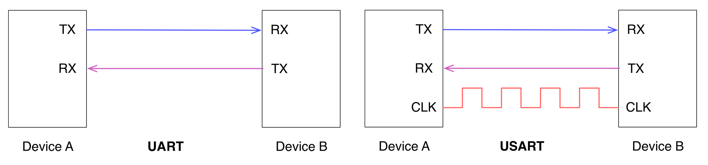
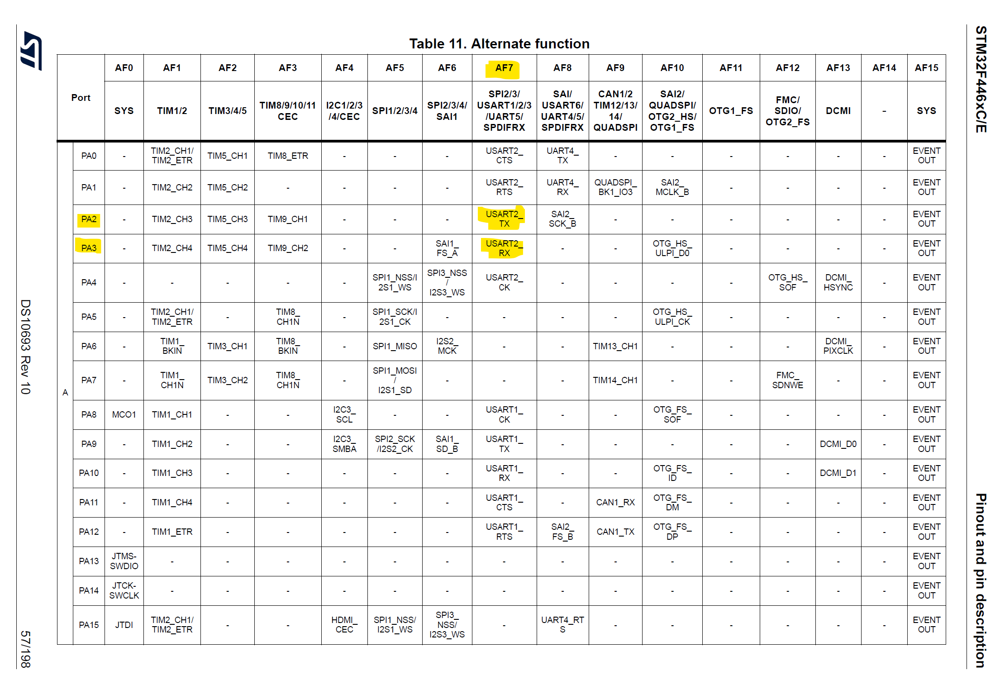
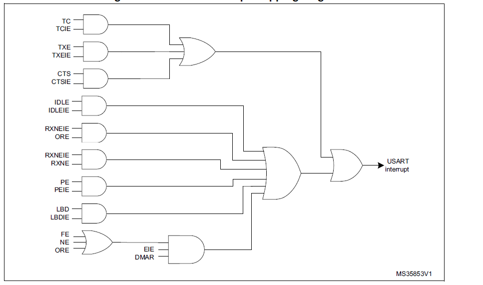
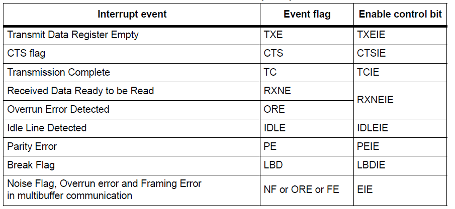
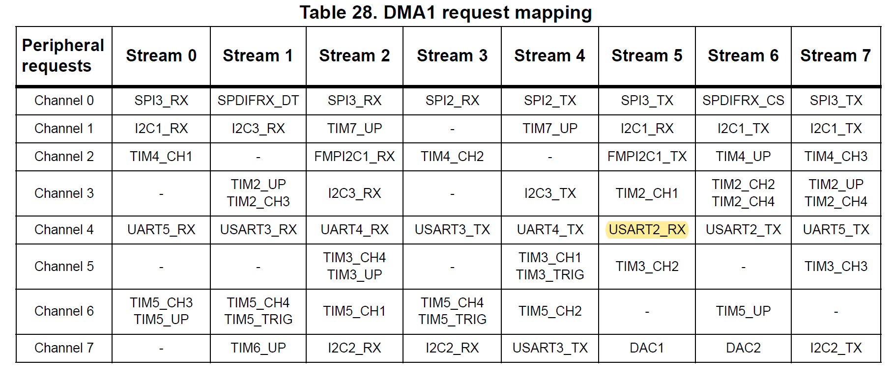

# Serial Communication (UART/USART)

</br>

## Overview
In the following it is reported a summary of this lecture involving serial communication interfaces like **UART**, **I²C** and **SPI**. This interfaces are used plenty for communicating with various devices and sensors.
In this lecture the main focus will be put on **UART** and **USART** interfaces. Simple exercises will be developed to use the serial protocols both in interrupt and polling mode.


## Theoretical Requirements
A serial communication efficiently uses just a single wire to transfer data, in term of bits, in a sequential manner.

Different serial communications establish different protocols to solve major problems related to communication between two devices. The first that can come to mind is, for example, to establish, on the receiver side, when a single bit or an entire sequence of data begins and ends.

An approach used by different protocols consists in using a *clock signal* "coupled" to the data, in this way it is possible to establish a synchronization between data and clock. A protocol that exploits a clock signal is called **synchronous**: for each pulse of the *clock signal* the transmitter sends a bit and the receiver synchronizes itself in accordance to one of the edges of the *clock signal* to carry out the reading. For example read the transmitted data on every falling edge.


The frequency of the *clock signal* determines how fast the data is transferred and how long the entire transmission lasts.

In case both devices, which want to communicate, already agree on the speed and transmission time of a single bit, then the *clock signal* is no longer needed and the communication can take place in accordance to the agreed rules. In this case the communication is called **asynchronous**.


Different devices can be interconnected in different ways in order to realize serial communications. For example, it is also possible to create a "network" of devices with the classic *master-slave* architecture; in this case the device that manages the clock takes the role of master. Well known communication protocols that make wide use of this logic (as we will see in the next lecture) are the **SPI** and **I2C** protocols.

<p align="center">
     
</p>

## UART e USART

Although the **synchronous** serial communication is used with many devices, the management of a signal (*the clock*) that needs both a dedicated line and a certain available bandwidth turns out to be difficult to manage in some cases. For this reason the research focused itself also on the development of **asynchronous** communication criteria. These also offer the advantage of being reliable over long distances, where a *clock signal* could degrade and cause you to lose synchronization.

The logic behind this type of communication is based on establishing the transmission duration of a single bit and avoiding the use of a synchronization clock. This mechanism is accomplished through a dedicated hardware device called **UART** (**U**niversal **A**synchronous **R**eceiver - **T**ransmitter), which is present in every microcontroller and allows communication with a myriad of devices.

In the simplest form, a **UART** communication uses only one connection for transmission (labeld as **TX**) and only one for reception (label as **RX**). It is important to establish the *data rate* with which the transmitter and receiver operate. This value is known in litterature and in practical environment as *baud rate*.

In addition to this value there are also other parameters that come into play when you want to send a data stream with **UART** communication. The main ones are the following:
- **Data bits**: Number of bits for single value transmitted (default: 8);
- **Stop bits**: Number of bits used to identify the end, the stop, of the data flow (default: 1);
- **Parity bit**: Presence and possible type of parity bit.

> :dart: 
A parity bit, or check bit, is a bit added to a string of binary code. Parity bits are a simple form of error detecting code. Parity bits are generally applied to the smallest units of a communication protocol, typically 8-bit octets (bytes), although they can also be applied separately to an entire message string of bits.

For the management of the **UART** in a microcontroller other important configuration parameters come into play, which also allow to put into practice different operating modes.

Often, this communication method is also accompanied by a clock signal, resulting in a (if necessary) synchronous protocol called **USART** (**U**niversal **S**ynchronous/**A**synchronous **R**eceiver-**T**ransmitter).

<p align="center">
     
</p>

While for **UART** communication a clock signal is generated internally in the microcontroller - starting from the knowledge of the *baud rate* and as soon as the first bit of the data stream is identified - for the **USART** communication there is no need to specify any *baud rate*. The clock signal travels on a dedicated channel and this allows even better results to be obtained. In some cases the data transfer *rate* can reach 4 Mbps. However, this implementation brings with it the disadvantages related to the presence of a clock signal.

### UART/USART in STM32 microcontrollers
Each microcontroller of the STM32 family exports at least one **UART** communication port. In the case of the microcontroller used for these exercises (F411RE) the devices embed three **UARTs** (UART3, UART4 and UART5)  and three universal synchronous/asynchronous receiver transmitters **USART** 
(USART1, USART2 and USART6).

The management of this type of communication obviously involves the use of appropriate registers that allow you to configure both a **USART** communication and **UART** communication, depending on the fields used. In the following, and also in the implementation phase, the two words will often be used in an equivalent way, specifying the distinction between the two only if necessary.

As for the configuration of the *baud rate*, we obviously use the system clock. As we will see it has to be suitably scaled in order to be adequate, on the **UART** peripheral, with the desired trasmission *rate*.
The following equation shows how to calculate the *baud rate*
<p align="center">
    
</p>

where $f_{ck}$ is clock frequency received by the peripheral and `OVER8` is the value of `OVER8` bit in the
`USART_CR1` register. This bit is used to specify the oversampling done by the UART/USART peripheral and can be either 16 `OVER8 = 0` or 8 `OVER8 = 1` times the baud rate clock.

The values that allow you to define the *baud rate* and other configuration parameters are all located into a set of registers, which are extensively described into the [reference manual](https://www.st.com/resource/en/reference_manual/dm00135183-stm32f446xx-advanced-arm-based-32-bit-mcus-stmicroelectronics.pdf) of the MCU.

:information_source:
For some MCU like the STM32F446RE and even the STM32F411RE, the **USART2** communication exploits the pins PA_2 and PA_3. These pins internally interconnects the microcontroller and the ST-Link module. They are therefore used to establish communication between the two elements and to put the microcontroller in communication with the PC, via the USB port. This communication is implicitly used in all the programming and debugging phases of the microcontroller. For this reason, as long as the ST-Link module is used it will be impossible to use these pins for other purposes.

Communication via **UART** can be practiced in three ways: *polling*, *interrupt* or *DMA mode*.

- *Polling Mode*
> The main application, or one of its threads, synchronously waits for the data transmission and reception. This is the most simple form of data communication using this peripheral, and it can be used when the transmit rate is not too much low and when the UART is not used as critical peripheral in our application 
- *Interrupt Mode*
> The main application is freed from waiting for the completion of data transmission and reception. The data transfer routines terminate as soon as they complete to configure the peripheral. When the data transmission ends, a subsequent interrupt will signal the main code about this.


## USART communication in STM32Cube

As shown below, in the development environment of *STM32Cube* it is possible to realize **UART** communication at different levels of abstraction. We will start with an example that uses directly the registers (in order to understand how they work) and then using the **HAL** functions.

In the example, the **USART** ports located on PA_2 and PA_3 will be used to communicate with the PC, via the USB port; if you do not have an external UART/USB converter then you will use the implicit communication provided by the ST-Link module.

<p align="center" width="30%">
    
</p>
</br>

The purpose of a first simple exercise is to send characters to the PC; the essential steps to take in order do so are the following:
1. Activation of the clock signal on **GPIO**

```c
/* GPIO Configuration (PA2 TX and PA3 RX) */
RCC->AHB1ENR |= (1 << RCC_AHB1ENR_GPIOAEN_Pos);
```

2. Configuration of the GPIOs in alternate function mode with Pull-up enabled
```c
// PA2 USART2 TX
GPIOA->MODER 	|= (0x02 << 4); 		// Alternate function
GPIOA->AFR[0] |= (0x07 << 8);			// Alternate function n7 (USART2 TX)
GPIOA->OTYPER &= ~(0x03 << 4); 		    // Push-Pull (Best suited for single direction line)
GPIOA->PUPDR  |= (0x01 << 4); 		    // USART should have external Pull-up for higher data rates
GPIOA->OSPEEDR |= (0x0A << 4);          // Set Fast Speed

// PA3 USART2 RX
GPIOA->MODER 	|= (0x02 << 6); 		// Alternate function
GPIOA->AFR[0] |= (0x07 << 12);		    // Alternate function n7 (USART2 TX)
GPIOA->PUPDR  |= (0x01 << 6); 		    // USART should have external Pull-up for higher data rates
```
The number of the alternate function associated to the `USART2` TX/RX can be found within the *datasheet* looking at the *alternate function table*

<p align="center" width="30%">
    
</p>

The Pull-up resistor is not mandatory for slow communication rated but, generally speaking, it is useful to enable it.

 &nbsp; note that the **AFRL** and **AFRH** registers are implemented using a two-element array: `AFR[0]` e `AFR[1]`. </br> &nbsp;

3. Enable clock and configure the USART peripheral
```c
/* USART Configuration */
RCC->APB1ENR |= (0x01 << RCC_APB1ENR_USART2EN_Pos); 	// Provide clock

USART2->CR1 |= (0x01 << USART_CR1_UE_Pos); 			// Enable USART (UE)
USART2->CR1 |= (0x01 << USART_CR1_M_Pos); 			// Define word length (8 bit data and 1 parity) (M)
USART2->CR2 |= (0x02 << USART_CR2_STOP_Pos); 		// Define number of stop bits (STOP)
USART2->CR1 |= (0x1 << USART_CR1_PCE_Pos); 			// Enable parity check (PCE)
USART2->CR1 &= ~(0x01 << USART_CR1_PS_Pos);			// Even parity (PS)

//273.4372
USART2->BRR |= (0x111 << USART_BRR_DIV_Mantissa_Pos);   // Define Mantissa
USART2->BRR  |= (0x07 << 0); 							// Define Fractional part
USART2->CR1 |= (0x01 << USART_CR1_TE_Pos); 			    // Send one idle frame at the beginning (TE)

USART2->CR1 |= (0x01 << USART_CR1_RE_Pos);			    // Enable Reception (RE)

```
Notice that following the instruction reported in the reference manual the peripheral is first enabled and then configured. The values used for the *baud rate* are determined in such a way to have a communication rate of 9600 baud.
The communication is set up is such a way to have 1 start bit, 8 bit of data, 1 parity bit and 2 stop bits.

At this point it is possible to send the data using the registers:
- **USART_DR** (**D**ata **R**egister)
> Which contains the value we want to transmit (or the value just received);
- **USART_SR** (**S**tatus **R**egister)
> Used when reading in order to identify different states such as, for example, the end of the transmission.

The implemented program is located in the project folder `usart_stm32`.

### Sending data acquired by ADC via UART
In this exercise data acquired from ADC will be transmitted through the UART peripheral. In this case, an interrupt approach will be used.

<p align="center">
    
</p>

Each UART peripheral has available *one* global interrupt service routine. In order to recognize the event that has generated the interrupt we can check several flags according to the following table.

<p align="center">
    
</p>

As an example application, the communication between MCU and PC is carried out by exchanging, as values, the subsequent readings of an analog value via **ADC** (using a **timer** to give a precise frequency to the reading).
> 🎯
The word "timer" is usually reserved for devices that counts down from a specified time interval. They are often used to generate clock signals or to measure specific time intervals. Every MCU generally has one or more timers and, in fact, they will be a topic for future lectures.


In this example the`float` number is sent through the **UART** in the form of bytes (as a string of characters representing the number). An alternative way would have been to transform the decimal value into an 8-bit value in a more "manual" way, perhaps putting the integer part and the decimal part separately in the array. In both cases, the burden of reconstructing the value received is left to the receiver.

Please remember that, to use the `sprintf()` function, it is necessary to activate a configuration field in the *Tool Setting* section of the project; as shown in the following screenshot.

<p align="center">
    
</p>

To carry out the transmission, the UART is configured as before but the interrupt enable bits for the TX Data register empty and Transfer complete bit are set. The transmission is started by writing into the data register and stopped by clearing the TXEIE bit.
```c
#include <math.h>
#define ADC_FS 3.3f

volatile uint16_t voltage = 0;
volatile float voltage_f = 0;
void ADC_IRQHandler() {
	if(((ADC1->SR >> ADC_SR_EOC_Pos) & 0x01)) {
		voltage = (uint16_t)ADC1->DR;
		voltage_f = voltage*(ADC_FS/pow(2, 12));
		ADC1->CR2 |= (0x1 << ADC_CR2_SWSTART_Pos);
	}
}

volatile char buff_tx[20];
volatile uint8_t rx_len, tx_len, cmd_received;
uint8_t tx_len_max;
void USART2_IRQHandler() {
	NVIC_ClearPendingIRQ(USART2_IRQn);
	if(tx_len < tx_len_max && (USART2->SR >> USART_SR_TXE_Pos) & 0x01) {
		USART2->DR = buff_tx[++tx_len];
	}
	else if((USART2->SR >> USART_SR_TC_Pos) & 0x01) {
		tx_len = 0;
		USART2->CR1 &= ~(0x01 << USART_CR1_TXEIE_Pos); 		// Enable Interrupt on USART2 transmission
	}
}

void send_str_it(volatile char *buff, uint8_t len) {
	USART2->DR = buff[0];
	tx_len_max = len - 1;
	USART2->CR1 |= (0x01 << USART_CR1_TXEIE_Pos); 		// Enable Interrupt on USART2 transmission
}
```
The main code is reported below 
```c
  send_str_it(buff_tx, 12);
  while (1)
  {
    /* USER CODE END WHILE */

    /* USER CODE BEGIN 3 */
	sprintf(buff_tx, "%1.3f\r\n", voltage_f);
	send_str_it(buff_tx, 7);
	HAL_Delay(1000);
  }
```
To send the values of the ADC through UART, the float number is converted in chars by mean of `sprintf(...)` function. Remember to include the `stdio.h` in order to use it.

The full code of the exercise is available within the `usart_adc_stm32` folder.

### Using the DMA

The **USART** can also be paired with the **DMA** peripheral to enable fast data transfers and reduce the computational load on the MCU.

**Direct Memory Access (DMA)** allows high-speed data movement:
- Between peripherals and memory  
- Or between memory locations  
- Without any CPU involvement

This frees up CPU resources for other tasks.

From a general point of view:
- Dual **AHB master bus** architecture  
- Independent **FIFOs**  
- Optimized for bandwidth via a complex **bus matrix**

There are **two DMA controllers** within our MCU of interest (**F446Re**): `DMA1` and `DMA2`
- Each has **8 streams**
- Each stream supports up to **8 channels** (requests)
- An **arbiter** handles request priorities

We will use the **DMA** to transfer received data directly from the `USART` data register (`DR`) into memory.

Lets see the configuration steps
1. **Configure the USART**  
   Set it up to generate a signal that triggers the DMA.

2. **Configure the DMA**  
   Set it to recognize the USART signal and perform the data transfer.

#### USART configuration

Concerning the **USART** we just need to enable the **DMA** to handle reception. In particular, a **DMA** request will be fired when the `RXNE` bit will be set (receive buffer not empty).
```c
  USART2->CR3 |= (0x01 << USART_CR3_DMAR_Pos); 			// enable DMA on RXNE activation
```

#### DMA configuration

The set up of the **DMA** is a little bit more tricky. In particular, we first need to find which **DMA** and which *channel* is able to handle the **USART** peripheral. This information can be found within the reference manual (Table 28)

<p align="center">
    
</p>

Once found the **DMA** and the specific *stream* and *channel* that handles the **USART** *receive* operation (`DMA1_Stream5` `channel4`) we can proceed with the set up

```c
 /* DMA Setup */
  RCC->AHB1ENR |= (0x01 << RCC_AHB1ENR_DMA1EN_Pos);

  DMA1_Stream5->CR |= (0b100 << DMA_SxCR_CHSEL_Pos);	// Stream 5 Channel 4 UART2 connection (101)

  DMA1_Stream5->PAR = (uint32_t)&USART2->DR;		// Peripheral address
  DMA1_Stream5->M0AR = (uint32_t)usart_buffer;		// Memory address
  DMA1_Stream5->CR &= ~(0b11 << DMA_SxCR_DIR_Pos); 		// Direction Peripheral to memory (00)

  DMA1_Stream5->CR &= ~(0b11 << DMA_SxCR_MSIZE_Pos); 	// 8 bit of memory for DMA transaction (00)
  DMA1_Stream5->CR &= ~(0b11 << DMA_SxCR_PSIZE_Pos); 	// 8 bit of peripheral for DMA transaction (00)

  DMA1_Stream5->CR |= (0b01 << DMA_SxCR_MINC_Pos);		// Increment memory address to fill buffer (1)
  DMA1_Stream5->CR &= ~(0b01 << DMA_SxCR_PINC_Pos);		// Do not increment peripheral address (0)

  DMA1_Stream5->CR |= (0b01 << DMA_SxCR_CIRC_Pos); 		// Enable circular mode (1)
  DMA1_Stream5->CR |= (0b01 << DMA_SxCR_TCIE_Pos); 		// Enable interrupt on transfer complete (1)

  DMA1_Stream5->FCR &= ~(0b1 << DMA_SxFCR_DMDIS_Pos); 	// Enable direct mode, no FIFO (0)

  DMA1_Stream5->NDTR = 4; 								// Number of transaction for data transmission
  DMA1_Stream5->CR |= (0b1 << DMA_SxCR_EN_Pos); 		// Enable DMA stream
```

Specifically,
- Enable the clock through `AHB1` bus
- Select channel 4 by setting up the `CHSEL` bit field within the `CR` register
- Specify the address of the *peripheral* and *memory* and the direction of the transaction (peripheral to memory specified by the bit `DIR`)
- The amount of data we want to take from the peripheral (`PSIZE`) and store within the memory `MSIZE` (in our case just one character so 8 bits)
- Enable to address increment for the memory (`MINC`) in such a way to not overwrite the received data (after each trasnsaction the **DMA** increse the address by the quantity `MSIZE`)
- Disable the memory increment for the peripheral (`PINC`)
- Enable the circular mode (`CIRC`) in such a way to get back to the starting memeory location after all the transaction have been performed. By doing so we set a sort of continous stream. After a complete set of transactions the **DMA** is does not turn off but keep on restarting
- Enable an interrupt when all the transactions have been performed `TCEIE`
- Disable the **FIFO** by setting a the direct mode `DMDIS`
- Specify the number of transactions we want to performe `NDTR`
- Enable the stream

We do not need to handle a **USART** interrupt but the **DMA** will notify us when a complete amount of transaction was performed. For this reason, we only need to write a **DMA ISR**

```c
void DMA1_Stream5_IRQHandler() {
	if(DMA1->HISR >> DMA_HISR_TCIF5_Pos & 0b1) {
		NVIC_ClearPendingIRQ(DMA1_Stream5_IRQn);
		data_available = 1;
		DMA1->HIFCR |= (0b1 << DMA_HIFCR_CTCIF5_Pos); 		// Clear status bit writing 1
	}
}
```

where we set a flag that will tell to our main code that a data is available. A working code is available within the project **usart_dma_stm32**. In particular, **usart_dma_stm32** project implement an application that forward the received data back to the trasmitter. Essentially, it's the same exercise implemented previously but in with the **DMA** functionality.


## Exercises
:pencil: 
Write a program that acquires data from a sensor and sends them, via **UART** communication, to the PC. The program must also be waiting to receive, again via **UART** communication, a stop command (for example a single character: 'S') which interrupts the sending of data but not their acquisition and a signal of start (for example a single character: 'P') to resume normal operation.

Make use of a temperature sensor, a potentiometer or any other analog sensor you have available as external sensor for data reading.

If possible, collect the acquired measurements in an array of at least 10 elements and send the average of these measurements to the PC. You can use a simple arithmetic average or alternatively a weighted average, which weighs more the last values inserted in the array. Note that, for this procedure to work correctly, data acquisition must occur at a frequency at least 10 times greater than the data transmission frequency.

Finally, use a signaling RGB LED (just one LED, the one with 4 pins OR four different LEDs) as described:
* Green LED: acquisition phase;
* Blue LED: data sending phase;
* Red LED: stop command received;
* White LED: acquisition phase after receiving the stop;

If possible, implement a "library" dedicated to managing the RGB LED or the single colored LEDs.

:question:
In the context of configuring the *baud rate* for a **UART** peripheral, the clock is assumed to be 16MHz and the system is oversampled to 16x (OVER8 = 0). So what is the value of USARTDIV if you want a *baud rate* of 9600? Finally, in which registers will the mantissa and exponent values be placed to achieve this configuration?

***
</br> </br>

:computer:
To interact (in transmission or reception) with the **UART** peripherals of the microcontroller it is possible to use one of the various software that can be easily found on the network. One of this is [*Real Term*](https://realterm.sourceforge.io), which offers the possibility to open **UART** communication with different *baud rates* and possible configurations. It can also be used as a transmitter to send data to a **UART** peripheral connected to the PC. The two main interfaces are illustrated below, highlighting the interaction sections.


<p align="center">
    
</p>

<p align="center">
    
</p>


Some alternatives could be [Putty](https://www.putty.org) or [TeraTerm](https://ttssh2.osdn.jp/index.html.en).

***
