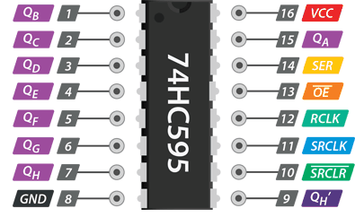

## Shift Register :twisted_rightwards_arrows:
A device that is often used to exploit the potential of **SPI** communication is the *Shift Register*.

Basically, a *Shift Register* is made up of a series of digital flip-flops, connected in series with each other. Each of them stores a 1 bit of information and every time the clock signal acts on the *Shift Register*, each flip-flop transmits its information to its next neighbor and receives new binary information from the one preceding it. The important feature is that the values contained in the flip-flops can all be read at the output at the same time, creating a parallel signal output.

In essence therefore, the serial signal that arrives at the input of the *Shift Register* is transformed into many different signals accessible in parallel. Obviously the operation can also be carried out in the opposite way, operating as a serial transmitter. This type of operation takes place internally in a **SPI** microcontroller peripheral, which works thanks to internal *Shift Registers*.

Often, *Shift Registers* external to the microcontroller are used, which allow, via **SPI** communication, to significantly increase the input/output possibilities.

### Texas Instruments // SN74HC595
For example, the *Shift Register* SN74HC595, produced by Texas Instruments, is analysed. By analyzing the [datasheet](docs/sn74hc595.pdf), you can determine the pinout of this device and its operation.

#### Features
* 8-Bit Serial-In, Parallel-Out Shift
* Wide Operating Voltage Range of 2 V to 6 V
* ±6-mA Output Drive at 5 V
* Low Power Consumption: 80-μA (Maximum)
> The SNx4HC595 devices contain an 8-bit, serial-in parallel-out shift register that feeds an 8-bit D-type storage register. The shift register has a direct overriding clear (**SRCLR**) input, serial (**SER**) input, and serial outputs for cascading. When the output-enable (**OE**) input is high, the outputs are in the high-impedance state

The device pinout is shown below; to use **SPI** signals, connect the `SER` pin to the **MOSI** signal, the `SRCLK` pin to **SCK** and finally `RCLK` equivalent to **SS**.

     

On the values of the `Q` outputs, from `A` to `H`, the signals entering the device in a serial manner will be in parallel form using **SPI** communication.

|Pin Number |Pin Name|Description|
| :-: | :-: | :-: |
|15, 1-7 |**QA, QB – QH** | Output Pins|
|8 |**GND** |Ground Pin|
|9 |**QH'** |QH' Output|
|10 |**SRCLR** |Reset Input|
|11 |**SRCLK** |Clock Input|
|12 |**RCLK** |Storage Register Clock Input|
|13 |**OE** |Output Enable|
|14 |**SER** |Serial Input|
|16 |**VCC** |Supply Voltage|

Ultimately, the operating system is very simple: at the rising edge of the **SRCLK** clock, the data present on **SER** is loaded into the *Shift Register* and when a rising edge is detected on ** RCLK** the data in the register is output to **QA**...**QH**.

***
 

:link: [SN74HC595](http://www.ti.com/product/SN74HC595)