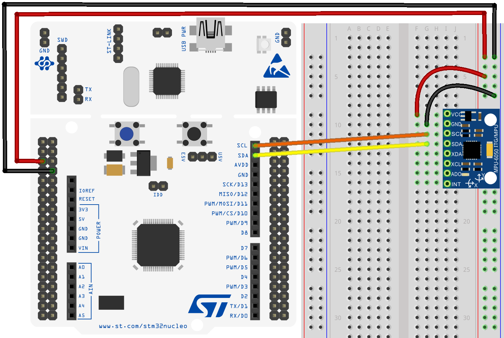

# Serial Communication Part 2: **I²C** and **SPI**

In the previous lesson we have analyzed the first (and perhaps most used in the amateur field) communication interface: the **UART**/**USART**

## I2C
The acronym **I²C** stands for "**I**nter **I**ntegrated **C**ircuit" and it is also a serial communication protocol that operates according to *master-slave* relationships.

It physically uses two wires (one for clock and one for data), which means that data only travels in one direction at a time.

As its name suggests, it is used for interconnections over fairly close distances, possibly with all the devices on the same integrated board, and allows the programmer to connect, at the same time, several *slaves* devices to a single *master*, using a single bus.

The mechanism to identify a particular *slave* device (among all the ones interconnected) is based on an addressing system according to which each device has a unique address for the **I²C** bus.

The communication, which is *half-duplex*, takes place on two lines, and takes place with a synchronous logic using two different signals:
* **SCL** (**S**erial **CL**ock)
* **SDA** (**S**erial **DA**ta)

<p align="center">
     
</p>

In addition to the data bits, on the **I²C** bus travels also a series of signals that operate as special delimiters in order to identify the *start* and the *stop* of the data flow. An **I²C** communication, based on the master-slave logic, follows specific rules. The first step is to send a *start* signal followed by the address (in 7-bit type) of the peripheral to communicate with. After that the device that is establishing a connection must specify, by means of a single bit, whether a reading (with a bit at 1) or a writing (with a bit at 0) communication is going to be carried out.

If the *slave* peripheral with the indicated address exists on the **I²C** bus, then it will respond with an ACK and the *master* will be able to initiate transmission or receive reception.

### I2C in STM32 microcontrollers
Taking as example the STMf446RE MCU, it is embedded with four **I²C** interfacing bus, which can operate in both *master* and *slave* modes; three of these bus can work in the standard mode (up to 100KHz) and also in a particular mode called fast mode (up to 400KHz).

Among the main features, it is possible to address with 7-bit or 10-bit values and well as an integrated hardware circuit for error control is provided.

In order to acquire a clear understanding of how each different mode operates, it is good idea to study the [reference manual](https://www.st.com/resource/en/reference_manual/dm00135183-stm32f446xx-advanced-arm-based-32-bit-mcus-stmicroelectronics.pdf) of the microcontroller. In fact, it contains a description of the two main modes of use:
- *Master mode*: 
> The **I²C** interface initiates a data transfer and generates the clock signal. A serial data transfer always begins with a start condition and ends with a stop condition. Both start and stop conditions are generated in master mode by software.
- *Slave mode*:
> In Slave mode, the interface is capable of recognizing its own addresses (7 or 10-bit), and the General Call address. The General Call address detection may be enabled or disabled by software. 

Both data and addresses are transferred as single bytes, specifying the MSB (Most Significant Bit) as the first value. The first byte(s) following the start condition contain the address (one in 7-bit mode, two in 10-bit mode). The address is always transmitted in Master mode. A 9th clock pulse follows the 8 clock cycles of a byte transfer, during which the receiver must
send an acknowledge bit to the transmitter.

<p align="center">
    
</p>

Acknowledge feature may be enabled or disabled by software. The $I^2C$ interface addresses (dual addressing 7-bit/ 10-bit and/or general call address) can be selected by software.

The $I^2C$ block diagram is given below
<p align="center">
    
</p>

Lets focus now in the $I^2C$ configuration and in particular on the masted modality
### I2C Master mode
In Master mode, the $I^2C$ interface initiates a data transfer and generates the clock signal. A serial data transfer always begins with a Start condition and ends with a Stop condition.
The first problem we need to handle is how to generate the clock we actually want to have. 

For this purpose we need to configure three registers: `CR2`, `CCR` and `TRISE`.
<p align="center">
    
</p>

the `CR2` register contains the bits `FREQ[5:0]` that  must be configured with the APB clock frequency value (I2C peripheral
connected to APB). The `FREQ` field is used by the peripheral to generate data setup and hold times compliant with the I2C specifications. The minimum allowed frequency is 2 MHz, the maximum frequency is limited by the maximum APB frequency (45 MHz) and cannot exceed 50 MHz (peripheral intrinsic maximum limit).

The `CCR` register is a little bit more trickier. Lets suppose we want to configure the peripheral at `1000kHz` with an APB clock of `45MHz`
<p align="center">
    
</p>

The `F/S` bits stands for *Fast* or *Standard* mode. The field we are interested with is represented by the bits `CCR[11:0]`. This bits are used for clock control in Fm/Sm mode (Master mode) and controls the SCL clock in master mode.
In particular, looking at the reference manual we get the following information:

* **Sm mode or SMBus**:

    - $t_{high}$ = CCR * $t_{plck1}$
    - $t_{low}$ = CCR * $t_{plck1}$
* Values for $t_{high}$ and $t_{low}$ (see the `CCR` register description)
    - $t_{high}$ = $t_{r(SCL)}$ + $t_{w(SCLH)}$. See device datasheet for the definitions of parameters.
    - $t_{low}$ = $t_{f(SCL)}$ + $t_{w(SCLL)}$. See device datasheet for the definitions of parameters.

Looking at the datasheet we can find the following table
<p align="center">
    
</p>

Doing a little bit of math we end up with the following formula

$$CCR = \frac{t_{r(SCL)} + t_{w(SCLH)}}{t_{plck1}} = \frac{1000.0 + 4000}{22.222} = 225$$

where $t_{plck1} = 22.2222 ns = 1/(45MHz) ns$. Note that everything is expressed in nano seconds.

After `CCR`, we will program the `TRISE` Register (`I2C_TRISE`). These bits should provide the maximum duration of the SCL feedback loop in master mode. The purpose is to keep a stable SCL frequency whatever the SCL rising edge duration.
These bits must be programmed with the maximum SCL rise time given in the I2C bus specification, incremented by 1. The formula to calculate `TRISE` value is shown below

$$ TRISE = \frac{t_{r(SCL)}}{t_{plck1}} + 1 = \frac{1000.0}{22.222} + 1 = 46 $$

After the clock configuration we can proceed configuring the peripheral. Specific details will be given in the case of study reported in this same document.

## I2C communication and configuration in STM32 (exercise)
Below it is reported an example of **I²C** communication between the microcontroller and an external module which is the sensor [MPU-6050](https://invensense.tdk.com/products/motion-tracking/6-axis/mpu-6050/) of InvenSense.

In order to use this sensor (as you would do for any other **I²C** module) it is necessary to deeply study the documentation released by the manufacturer. In fact there all the physical/electrical information are reported and also everything we need to know in order to retrieve the measurements through the **I²C** interface.
```c
void I2C_Config() {
	RCC->AHB1ENR |= (1 << RCC_AHB1ENR_GPIOBEN_Pos);  // Enable GPIOB CLOCK

	GPIOB->MODER 	|= (2 << 16) | (2 << 18);  	// Bits (17:16)= 1:0 --> Alternate Function for Pin PB8;
	GPIOB->OTYPER 	|= (1 << 8)  | (1 << 9);  	// Bit8=1, Bit9=1  output open drain
	GPIOB->OSPEEDR 	|= (3 << 16) | (3 << 18);  	// Bits (17:16)= 1:1 --> High Speed for PIN PB8; Bits (19:18)= 1:1 --> High Speed for PIN PB9
	GPIOB->PUPDR 	|= (1 << 16) | (1 << 18);  	// Bits (17:16)= 0:1 --> Pull up for PIN PB8; Bits (19:18)= 0:1 --> pull up for PIN PB9
	GPIOB->AFR[1] 	|= (4 << 0)  | (4 << 4);  	// Bits (3:2:1:0) = 0:1:0:0 --> AF4 for pin PB8;  Bits (7:6:5:4) = 0:1:0:0 --> AF4 for pin PB9


	RCC->APB1ENR |= (1 << RCC_APB1ENR_I2C1EN_Pos);  // Enable I2C1 CLOCK

	I2C1->CR1 	|= (1 << I2C_CR1_SWRST_Pos);  	// reset the I2C
	I2C1->CR1 	&= ~(1 << I2C_CR1_SWRST_Pos);  	// Normal operation
	// Program the peripheral input clock in I2C_CR2 Register in order to generate correct timings
	I2C1->CR2 	|= (45 << 0);  					// PCLK1 FREQUENCY in MHz
	// Configure the clock control registers
	I2C1->CCR 	= 225 << 0;  					// computed as reported on github
	// Configure the rise time register
	I2C1->TRISE = 46;  							// computed as reported on github
	// Program the I2C_CR1 register to enable the peripheral
	I2C1->CR1 	|= (1 << I2C_CR1_ACK_Pos);  	// Enable the ACK
	I2C1->CR1 	|= (1 << 0);  	                // Enable I2C
}
```
* The **I2C** makes use of the GPIOs in order to receive and transmit data, for this reason we need to properly configure GPIOs.
First we enable the port, providing clock through `AHB1` bus and then configure them in alternate function mode. Find the correct *alternate function* value within the *alternate function table* in the datasheet.
It is important to configure the GPIOs in **open drain** output mode with **Pull-up** enabled. Usually internal Pull-up resistors are too weak and external ones should be used. In this case, internal ones will be enough to achieve a stable communication.
* As every peripheral we first provide the clock (`APB1` bus) and then proceed with the configuration. For a fresh configuration a software reset is fired by setting and clearing the `SWRST` bit. The clock configurations computed previously are used and the ack functionality is enabled. As last operation the peripheral is enabled.

```c
void I2C_Start() {
	/**** STEPS FOLLOWED  ************
	1. Enable the ACK
	2. Send the START condition
	3. Wait for the SB ( Bit 0 in SR1) to set. This indicates that the start condition is generated
	*/
	I2C1->CR1 |= (1 << I2C_CR1_START_Pos);          // Generate START
	while(!(I2C1->SR1 & (1 << I2C_SR1_SB_Pos)));    // wait for ADDR bit to set
}

void I2C_Stop() {
	/**** STEP 2-g ****/
	I2C1->CR1 |= (1 << I2C_CR1_STOP_Pos);  // Stop I2C
}
```
The software has the responsibility to generate *start* and *stop* conditions. The functions above are created exactly for this purpose. The peripheral exports specific bits like `START`, `STOP`. For start condition we can check that it was correctly generated by reading the bit `SB` in `CR1`.

```c
void I2C_Write(uint8_t data) {
	/**** STEPS FOLLOWED  ************
	1. Wait for the TXE (bit 7 in SR1) to set. This indicates that the DR is empty
	2. Send the DATA to the DR Register
	3. Wait for the BTF (bit 2 in SR1) to set. This indicates the end of LAST DATA transmission
	*/
	while (!(I2C1->SR1 & (1<< I2C_SR1_TXE_Pos)));  // wait for TXE bit to set
	I2C1->DR = data;
	while (!(I2C1->SR1 & (1<< I2C_SR1_BTF_Pos)));  // wait for BTF bit to set
}

void I2C_Address(uint8_t address) {
	/**** STEPS FOLLOWED  ************
	1. Send the Slave Address to the DR Register
	2. Wait for the ADDR (bit 1 in SR1) to set. This indicates the end of address transmission
	3. clear the ADDR by reading the SR1 and SR2
	*/
	uint8_t temp = I2C1->SR1;
	I2C1->DR = address;  							//  send the address
	while(!(I2C1->SR1 & (1 << I2C_SR1_ADDR_Pos)));  // wait for ADDR bit to set
	temp = I2C1->SR1 | I2C1->SR2;  					// read SR1 and SR2 to clear the ADDR bit
}

void I2C_Read(uint8_t address, uint8_t *buffer, size_t size) {
	/**** STEPS FOLLOWED  ************
	1. If only 1 BYTE needs to be Read
		a) Write the slave Address, and wait for the ADDR bit (bit 1 in SR1) to be set
		b) the Acknowledge disable is made during EV6 (before ADDR flag is cleared) and the STOP condition generation is made after EV6
		c) Wait for the RXNE (Receive Buffer not Empty) bit to set
		d) Read the data from the DR

	2. If Multiple BYTES needs to be read
	  a) Write the slave Address, and wait for the ADDR bit (bit 1 in SR1) to be set
		b) Clear the ADDR bit by reading the SR1 and SR2 Registers
		c) Wait for the RXNE (Receive buffer not empty) bit to set
		d) Read the data from the DR
		e) Generate the Acknowlegment by settint the ACK (bit 10 in SR1)
		f) To generate the nonacknowledge pulse after the last received data byte, the ACK bit must be cleared just after reading the
			 second last data byte (after second last RxNE event)
		g) In order to generate the Stop/Restart condition, software must set the STOP/START bit
		   after reading the second last data byte (after the second last RxNE event)
	*/
	int remaining = size;

	/**** STEP 1 ****/
		if(size == 1) {
			/**** STEP 1-a ****/
			I2C1->DR = address;  //  send the address
			while(!(I2C1->SR1 & (1<<1)));  // wait for ADDR bit to set

			/**** STEP 1-b ****/
			I2C1->CR1 &= ~(1<<10);  // clear the ACK bit
			uint8_t temp = I2C1->SR1 | I2C1->SR2;  // read SR1 and SR2 to clear the ADDR bit.... EV6 condition
			I2C1->CR1 |= (1<<9);  // Stop I2C

			/**** STEP 1-c ****/
			while (!(I2C1->SR1 & (1<<6)));  // wait for RxNE to set

			/**** STEP 1-d ****/
			buffer[size-remaining] = I2C1->DR;  // Read the data from the DATA REGISTER
		}

	/**** STEP 2 ****/
		else {
			/**** STEP 2-a ****/
			I2C1->DR = address;  //  send the address
			while(!(I2C1->SR1 & (1 << I2C_SR1_ADDR_Pos)));  // wait for ADDR bit to set

			/**** STEP 2-b ****/
			uint8_t temp = I2C1->SR1 | I2C1->SR2;  // read SR1 and SR2 to clear the ADDR bit

			while(remaining > 2) {
				/**** STEP 2-c ****/
				while(!(I2C1->SR1 & (1 << I2C_SR1_RX)));  // wait for RxNE to set

				/**** STEP 2-d ****/
				buffer[size-remaining] = I2C1->DR;  // copy the data into the buffer

				/**** STEP 2-e ****/
				I2C1->CR1 |= 1 << I2C_CR1_ACK_Pos;  // Set the ACK bit to Acknowledge the data received

				remaining--;
			}

			// Read the SECOND LAST BYTE
			while(!(I2C1->SR1 & (1 << I2C_SR1_RXNE_Pos)));  // wait for RxNE to set
			buffer[size-remaining] = I2C1->DR;

			/**** STEP 2-f ****/
			I2C1->CR1 &= ~(1 << I2C_CR1_ACK_Pos);  // clear the ACK bit

			/**** STEP 2-g ****/
			I2C1->CR1 |= (1 << I2C_CR1_STOP_Pos);  // Stop I2C

			remaining--;

			// Read the Last BYTE
			while (!(I2C1->SR1 & (1 << I2C_SR1_RXNE_Pos)));  	// wait for RxNE to set
			buffer[size-remaining] = I2C1->DR;  // copy the data into the buffer
		}
}
```
Reading and writing operations follows the I2C standard. To send address a different function is implemented in order to check specific condition on particular bits exported by the peripheral. For example it is possible to check if the address was correctly transmitted.

:rocket: Once the software tools to manage the operation of the bus and the **I²C** protocol are clear, it is possible to study the details related to the sensor to be used and then proceed writing the program that will read the values it provides. The sensor in question, MPU-6050, is a *6 DOF IMU*, which is encapsulated on a **I²C** ready-to-connect module; this is connected to the development board as indicated.

<p align="center">
    
</p>

All the information necessary for the implementation of a program that achieves correct communication with the sensor is obtained following the the [datasheet](docs/MPU-60x0-Datasheet.pdf) and the [documentation relating to the registers contained in the MPU-6050 form](docs/MPU-60x0-Register-Map.pdf). 

In such a context it makes sense to implement a *library* that deals with managing the sensor and mediating the **I²C** communication, as specified in the file [MPU-6050.md](MPU-6050.md). Thanks to the illustrated library it is possible to structure the `main.c` so that the functions exported from the library itself are invoked for the configuration and reading of the data from the sensor. 

Here we report the most important functions

```c
void MPU6050_Init(void)
{
	uint8_t check;
	uint8_t Data;

	// check device ID WHO_AM_I

	MPU_Read(MPU_6050_ADDRESS, WHO_AM_I_REG, &check, 1);

	if (check == 104)  // 0x68 will be returned by the sensor if everything goes well
	{
		// power management register 0X6B we should write all 0's to wake the sensor up
		Data = 0;
		MPU_Write (MPU_6050_ADDRESS, PWR_MGMT_1_REG, Data);

		// Set DATA RATE of 1KHz by writing SMPLRT_DIV register
		Data = 0x07;
		MPU_Write(MPU_6050_ADDRESS, SMPLRT_DIV_REG, Data);

		// Set accelerometer configuration in ACCEL_CONFIG Register
		// XA_ST=0,YA_ST=0,ZA_ST=0, FS_SEL=0 -> ? 2g
		Data = 0x00;
		MPU_Write(MPU_6050_ADDRESS, ACCEL_CONFIG_REG, Data);

		// Set Gyroscopic configuration in GYRO_CONFIG Register
		// XG_ST=0,YG_ST=0,ZG_ST=0, FS_SEL=0 -> ? 250 ?/s
		Data = 0x00;
		MPU_Write(MPU_6050_ADDRESS, GYRO_CONFIG_REG, Data);
	}
}

void MPU_Read(uint8_t address, uint8_t reg, uint8_t *buffer, uint8_t size)
{
	/**** STEPS FOLLOWED  ************
	1. START the I2C
	2. Send the ADDRESS of the Device
	3. Send the ADDRESS of the Register, where you want to READ the data from
	4. Send the RESTART condition
	5. Send the Address (READ) of the device
	6. Read the data
	7. STOP the I2C
	*/
	I2C_Start();
	I2C_Address(address);
	I2C_Write(reg); 		// R/W 0
	I2C_Start();  			// repeated start
	I2C_Read(address + 0x01, buffer, size); // R/W 1
	I2C_Stop();
}

void MPU_Write(uint8_t address, uint8_t reg, uint8_t data)
{
	/**** STEPS FOLLOWED  ************
	1. START the I2C
	2. Send the ADDRESS of the Device
	3. Send the ADDRESS of the Register, where you want to write the data to
	4. Send the DATA
	5. STOP the I2C
	*/
	I2C_Start();
	I2C_Address(address);
	I2C_Write(reg);
	I2C_Write(data);
	I2C_Stop();
}
```
Macros for register address are defined within the library 
```c
#ifndef INC_MPU_6050_H_
#define INC_MPU_6050_H_


#define MPU_6050_ADDRESS 0b11010000

#define WHO_AM_I_REG 		117
#define PWR_MGMT_1_REG 		107
#define SMPLRT_DIV_REG 		25
#define ACCEL_CONFIG_REG 	28
#define GYRO_CONFIG_REG		27
#define ACCEL_XOUT_H_REG    59


#endif /* INC_MPU_6050_H_ */
```
***
## SPI
Each STM32 microcontroller provides at least one **SPI** (**S**erial **P**eripheral **I**nterface) interface, which allows the programmer to develop *master-slave* logic applications in which a *master* device (for example the STM board) is interconnected with multiple external devices (for example sensors not already included in your PCB), which act as *slaves*. In this way, like we have seen for **I<sup>2</sup>C** communication, it is possible to greatly expand the communication possibilities of the microcontroller, which through a single peripheral, for example **SPI**, can communicate with many external devices.

It is a *synchronous* protocol that allows *full-duplex* or *half-duplex* communication of multiple devices on the same bus. When the *master* initiates a communication it selects one of the *slave* devices and sends it a byte that begins the data exchange; typically a unmeaningful byte (*dummy byte*) is used to start the communication.

The **SPI** protocol exploits mainly 4 signals:
* **SCLK** (**S**erial **CL**o**K**)
> This signal is used to generate the clock to synchronize data transfer over the **SPI** bus. It is generated by the master device, and this means that in an **SPI** bus every transfer is always
started by the master. 
* **MOSI** (**M**aster **O**utput **S**lave **I**nput)
> It is used to send data from the master device to a slave one. 
* **MISO** (**M**aster **I**nput **S**lave **O**utput)
> It is used to send data from a slave device to the master.
* **SSn** (**S**lave **S**elect on line **n**)
> In a typical **SPI** bus there exist 'n' separated lines used to address the specific **SPI** devices involved in a transaction.  In a typical **SPI** bus only one slave device can be active at same time by asserting low its **SS** line.

<p align="center">
     
</p>

Intrinsically, thanks to the presence of the two lines (**MOSI** and **MISO**), the **SPI** communication is of the *full-duplex* type; however, there is generally the possibility to use it also in *half-duplex* or *simplex*. If a single master is put in communication with a single slave on the **SPI** bus, the **SS** signal can be omitted and in general the two lines, **MISO** and **MOSI**, can be merged on a single line called **SISO** (**S**lave **I**n/**S**lave **O**ut).

**SPI** communication is perfect for applications that deal with digital signal processing in which is required a communication that involves fast data transfer with precise time recurrences.

In general, this communication standard is quite effective and efficient, moreover, many **SPI** devices turn out to be easy to use. Among the disadvantages, however, there is the lack of knowledge of the state of the receiver (lack of *ack* mechanism) and the difficulty in structuring a more complex system, with only one *master* and many *slaves* connected in physically distant places.

### SPI in STM32 microcontrollers
Up to 4 **SPI** interfaces can be used in the STM32F446RE microcontroller (5 for the F411RE), both in *master* and *slaves* modes and in *full-duplex* and *simplex* types.

The SPI1 and SPI4 interfaces guarantee communication up to 45Mbit/s while SPI2 and SPI3 operate up to a maximum of 22.5Mbit/s. This communication speed obviously depends on the system clock and on *prescaling* parameters that are selected in the configuration phase.

The **SPI** peripheral offers a hardware CRC system and can also be used for communication with external SD cards.

As particular methods of use, there is the possibility of operating in **TI** mode and **I2S** mode, the latter particularly useful in acoustic processing contexts.

<p align="center">
    
</p>

Since it is a synchronous communication, the **SCK** signal is of fundamental importance, which synchronizes the data traveling on the various lines. Furthermore, communication can take place in different formats which depend on the *phase of the clock* and its *polarity*. These parameters must be agreed by *master* and *slave* in order to communicate correctly; communication can be configured in four different modes, based on the choice of *polarity* and *phase* of the clock.

|Mode|CPOL|CPHA|
|:--:|:--:|:--:|
|  0 |  0 |  0 |
|  1 |  0 |  1 |
|  2 |  1 |  0 |
|  3 |  1 |  1 |
 
* At **CPOL** = 0 the base value of the clock is zero, i.e. the active state is 1 and idle state is 0.
    * For **CPHA** = 0, data is captured on the **SCK** rising edge and data is output on a falling edge.
    * For **CPHA** = 1, data is captured on the **SCK** falling edge and data is output on a rising edge.
* At **CPOL** = 1 the base value of the clock is one, i.e. the active state is 0 and idle state is 1.
    * For **CPHA** = 0, data is captured on **SCK** falling edge and data is output on a rising edge.
    * For **CPHA** = 1, data is captured on **SCK** rising edge and data is output on a falling edge.

<p align="center">
    
</p>

For more info, as well as the documentation of the microcontroller, it is possible to refer to the [guide released by Motorola](https://web.archive.org/web/20150413003534/http://www.ee.nmt.edu/~teare/ee308l/datasheets/S12SPIV3.pdf), regarding the **SPI** communication standard.
***

## SPI communication and configuration in STM32 (exercise)
As the I2C, also the SPI makes use of GPIOs. In particular the GPIOs PA5, PA6, PA7 and a CS GPIO (in this exercise PB6) need to be configured in order to output the proper functionalities
```c
void GPIOConfig(void)
{
	RCC->AHB1ENR |= (1 << 0);  // Enable GPIOA Clock
	RCC->AHB1ENR |= (1 << 1);  // Enable GPIOB Clock

	GPIOA->MODER |= (2 << 10) | (2 << 12) | (2 << 14) | (1 << 18);  // Alternate functions for PA5, PA6, PA7

	GPIOA->OSPEEDR |= (3 << 10) | (3 << 12) | (3 << 14) | (3 << 18);  // HIGH Speed for PA5, PA6, PA7

	GPIOA->AFR[0] |= (5 << 20) | (5 << 24) | (5 << 28);   // AF5(SPI1) for PA5, PA6, PA7

	GPIOB->MODER 	|= (1 << 12);  	//Output for PB6
	GPIOB->OSPEEDR 	|= (3 << 12);  	// HIGH Speed for PB6
	GPIOB->ODR 		|= (1 << 6);
}
```
In the above function, first clock is provided to port B and A and all the GPIOs are configured in alternate function mode and output mode (for the CS signal). Notice that in this case no Pull-up in mandatory and the output signals are push-pull.

```c
void SPIConfig(void)
{
	/************** STEPS TO FOLLOW *****************
	1. Enable SPI clock
	2. Configure the Control Register 1
	3. Configure the CR2
	************************************************/
  RCC->APB2ENR |= (1 << 12);  // Enable SPI1 CLock

  SPI1->CR1 |= (1 << 0) | (1 << 1);   // CPOL=1, CPHA=1

  SPI1->CR1 |= (7 << 3);  // BR[2:0] = 011: fPCLK/16, PCLK2 = 80MHz, SPI clk = 5MHz

  SPI1->CR1 &= ~(1 << 7);  // LSBFIRST = 0, MSB first

  SPI1->CR1 |= (1 << 8) | (1 << 9);  // SSM=1, SSi=1 -> Software Slave Management

  SPI1->CR1 &= ~(1 << 10);  // RXONLY = 0, full-duplex

  SPI1->CR1 &= ~(1 << 11);  // DFF=0, 8 bit data

  SPI1->CR2 = 0;

  SPI1->CR1 |= (1 << 2);  // Master Mode
}
```
The configuration of the SPI peripheral follows the steps described in the reference manual. 
* Provide the clock
* Set-up the transmission mode (clock phase and polarity)
* Configure proscaler
* LSB or MSB first
* CS management
* Type of communication and data lenght
* Finally specify Master or Slave mode

```c
void SPI_Enable(void)
{
	SPI1->CR1 |= (1 << 6);   // SPE=1, Peripheral enabled
}

void SPI_Disable(void)
{
	SPI1->CR1 &= ~(1 << 6);   // SPE=0, Peripheral Disabled
}
```
The peripheral can be enable and disable by means of specific function. These function just set and clear the `SPE` bit.

```c
void SPI_Transmit(uint8_t *data, int size)
{

	/************** STEPS TO FOLLOW *****************
	1. Wait for the TXE bit to set in the Status Register
	2. Write the data to the Data Register
	3. After the data has been transmitted, wait for the BSY bit to reset in Status Register
	4. Clear the Overrun flag by reading DR and SR
	************************************************/

	int i=0;
	while (i<size)
	{
	   while (!((SPI1->SR)&(1<<1))) {};  // wait for TXE bit to set -> This will indicate that the buffer is empty
	   SPI1->DR = data[i];  // load the data into the Data Register
	   i++;
	}


	/*During discontinuous communications, there is a 2 APB clock period delay between the
	write operation to the SPI_DR register and BSY bit setting. As a consequence it is
	mandatory to wait first until TXE is set and then until BSY is cleared after writing the last
	data.
	*/
	while (!((SPI1->SR)&(1<<1))) {};  // wait for TXE bit to set -> This will indicate that the buffer is empty
	while (((SPI1->SR)&(1<<7))) {};  // wait for BSY bit to Reset -> This will indicate that SPI is not busy in communication

	//  Clear the Overrun flag by reading DR and SR
	uint8_t temp = SPI1->DR;
	temp = SPI1->SR;

}

void SPI_Receive(uint8_t *data, int size)
{
	/************** STEPS TO FOLLOW *****************
	1. Wait for the BSY bit to reset in Status Register
	2. Send some Dummy data before reading the DATA
	3. Wait for the RXNE bit to Set in the status Register
	4. Read data from Data Register
	************************************************/
	GPIOB->ODR &= ~(1 << 6);
	while (size)
	{
		while (((SPI1->SR) & (1 << 7))) {};  // wait for BSY bit to Reset -> This will indicate that SPI is not busy in communication
		SPI1->DR = 0;  // send dummy data
		while (!((SPI1->SR) &(1<<0))){};  // Wait for RXNE to set -> This will indicate that the Rx buffer is not empty
	    *data++ = (SPI1->DR);
		size--;
	}
	GPIOB->ODR |= (1 << 6);
}
```

Transmission and reception are handled by means of function implemented following a polling approach. There are specific bits (`RXNE` for reception and `TXE` for transmission) that the software can check in order to know when data is received or when it is safe to start a transmisison.

:twisted_rightwards_arrows: For an example of use of an external **SPI** device, we use a *Shift Register*, described a little more in detail in the file[74HC595-ShiftRegister.md](74HC595-ShiftRegister.md), which also reports the specifications and references of the device used: the model **SN74HC595** by Texas Instruments.

<p align="center">
    
</p>

In the following example we will use the *Shift Register*, connecting it to the *SPI1* interface of the microcontroller, using some of its parallel outputs to manage an RGB LED.

The value that is sent to the device, via **SPI**, will each time be an 8-bit unsigned variable (`uint8_t`) which represents the color to be lit on the RGB LED. The three lines of the LED are in fact connected to three outputs of the *Shift Register*. For example, when the binary value `00000010` is sent, at the output there will be only **QB** set at the high value and all the others left to 0. Based on the connection made, shown in the figure, the red of the RGB LED will light up. For a value instead of `00101010`, all three colors will turn on, resulting into white light.
```c
/* Define Colours- Shift Register Outputs
* QA -> NO
* QB -> RED
* QC -> NO
* QD -> GREEN
* QE -> NO
* QF -> BLU
*
* Q-H G F E D C B A
* 0b0 0 0 0 0 0 0 0
* */

#define RED 0b00000010
#define GRE 0b00001000
#define BLU 0b00100000
#define ORA 0b00001010
#define VIO 0b00100010
#define LBL 0b00101000
#define WHI 0b00101010
```
For **SPI** peripheral configuration we use the above functions, using pins PA_5 and PA_7 for **SCK** and **MOSI** and a GPIO on port B (PB_6) for the **signal RCLK** of the *Shift Register*. Configure the transmission mode to handle only the *master* transmission and use a *prescalar* to slow down the transmission speed, since in the example shown it will not be necessary to work with high rates.

 Note also that pin PB_6 is used with the operating logic with which the **RCLK** signal of the *Shift Register* operates: after having transmitted the data via **SPI**, when a rising edge on the pin PB_6 accurs then the data is loaded into the *Shift Register* and, in the same time, sent to the output.

## Exercises
:pencil: 
The main goal is that to write a program that emulates the behaviour of a controller used for *Binary Automatic Water Tank Level Tracking*. The general structure of the control system is shown in the figure below. The program must acquire data from a sensor located in the *Measurement System* module. For sake of simplicity, we will assume a linear potentiometer is used to measure the *Actual Level* of the water in the tank. Is up to the student to decide the configuration of the ADC in order to retrieve this data. Via **UART** communication, if required, the actual measure of the water level should be sent. In this case if a specific command (for example a single character: 'K') is received, the MCU should provide the requested data. On the other hand, again via **UART** communication, with the interrupt logic or using DMA, the MCU receives a specific message with value to be tracked, called *Reference Level*. The reference should be valid only if the message received is in the form *R XXX* (optional, even just the value *XXX* is enough). It is necessary to check if the received value is coherent with the MAX_HEIGHT_VALUE and MIN_HEIGHT_VALUE setted in an arbitrary way by the student. 

<p align="center">
    
</p> 


The main goal is that to keep the *Actual Level* as close as possible to the *Reference Level*. Using Digital I/O, open/close two on/off valves located on top and at the bottom of the tank in order to regulate the water level to the desired value. 

The logic conditions to control the water level are the following: 
* if *Actual Level* is greater than *Reference Level*, then close top valve and open bottom valve;
* if *Actual Level* is less than *Reference Level*, then open top valve and close bottom vale;

It is important that to each valve there is a LED associated, to indicate the state of the valve. For this reason, use another 2 Digital I/O pins to control the just mentioned LEDs. 
If possible, implement a "library" dedicated to managing the *Binary Automatic Water Tank Level Tracking* System.
