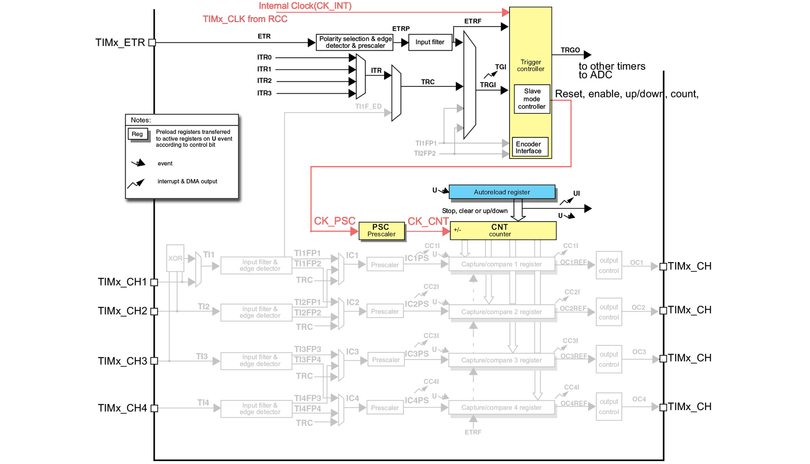

# Timers e PWM

</br>


## Overview
In this lesson the use of **timers** and **PWM** signals in *STM32Cube* is analyzed using a series of exercises and examples.

## Timers

### Theorical Overview
Many times in the development of a program it is necessary, for various reasons, to *wait* for somenthing to happen. It can be possible to use `HAL_Delay()` in a very simple and straightforward  way but such a function is *blocking* function for the microcontroller.

In most embedded systems, the exact knowledge of how much time has passed can be essential for time management and often providing an immediate response to a certain event is crucial. A wait that makes the CPU "waste time" is not appropriate and that's why all microcontrollers provide *dedicated hardware peripherals* for time management: **Timers**.

A **timer**, as a hardware device, is a counter that performs its *count* operations with a frequency that is somehow related to the *clock* source of the MCU,  both internal or external. This count is carried out by increasing (or decreasing) the value contained in suitable registers until an *overflow* situation occurs, which causes an **interrupt**. The maximum value beyond which the *overflow* occurs depends on the **timer** resolution (for example, for a **timer** with 16 bit resolution the maximum value is 65535).

The main elements that constitute a **timer** peripheral are:
- A *prescalar*;
- A register in which the current value of the **timer** is kept: *timer register*;
- A register that saves the value of the *timer register* when particular events occurs: *capture register*;
- A register that contains a value that is periodically compared with the value of the *timer register*: the *compare register*.

Thanks to these it is possible to manage, even with the **interrupts** mechanism, the **timers**, using them in different ways.

### Timers in STM32 microcontrollers

Up to 17 **timers** can be used in the STM32F466RE microcontroller, as reported in the datasheet:
> 2x watchdog, 1x SysTick timer and up to twelve 16-bit and two 32-bit timers up to 180 MHz.
<p>

	
Like for the other microcontrollers of the STM32 family, these are logically divided as follows
* *Advanced-Control Timers* : TIM1, TIM8 (16 bit)
* *General-Purpose Timers* : TIM2, TIM5 (32 bit) | TIM3, TIM4, TIM9-TIM14 (16 bit)
* *Basic-Configuration Timers* : TIM6, TIM7 (16 bit)

According to its type, a **timer** can be used in different *modes*, the main ones are: *compare mode*, *capture mode*, and *PWM mode*. These allow the programmer to use a **timer** not only to perform counter functions but also to create more complex functions. In the next part of the lesson we will analyze, as already specified, what are the main ingredients (the internal components and main registers) in order to set up these modes. Note that a *general purpose timer* can be used to serve the same purposes as a *basic timer*, but the contrary is not true.
</p>

An accurate description of the characteristics of the **timers**, can be found on [datasheet](https://www.st.com/resource/en/datasheet/stm32f446mc.pdf) and [reference manual](https://www.st.com/resource/en/reference_manual/dm00135183-stm32f446xx-advanced-arm-based-32-bit-mcus-stmicroelectronics.pdf); below is reported a table that schematizes the main characteristics.

<p align="center">
    
</p>

Each type of **timer** must be used appropriately taking into account its capabilities and characteristics; even in a development environment like *STM32Cube*, using the **HAL** driver, the programmer needs to refer to different functions and structures in order to use the different types of **timers**.

## Using Timers in STM32Cube

### :alarm_clock: Basic Timers
> The basic timers **TIM6** and **TIM7** consist of a 16-bit auto-reload counter driven by a programmable prescaler.</br>
They may be used as generic timers for time-base generation but they are also specifically used to drive the digital-to-analog converter (DAC).

Once we have knowledge on how a **timer** of this type works, it is possible to properly put it into operation using the information available on the reference manual.
Lets see first how to set up a timer in order to count microseconds. Remember that this operation cannot be achieved with the `HAL_Delay(...)` function that is able to count milliseconds.
```c
void TIM6_basic_setup() {

	RCC->APB1ENR |= (1 << RCC_APB1ENR_TIM6EN_Pos); 		// Clock to TIM6

	TIM6->CR1 &= ~(1 << TIM_CR1_UDIS_Pos); 		// Update event enable
	TIM6->CR1 |= (1 << TIM_CR1_URS_Pos);		// Update event generated only by overflow/underflow
	TIM6->CR1 |= (1 << TIM_CR1_ARPE_Pos); 		// Auto reload preload enabled

	TIM6->PSC = 2 - 1; 						    // CLock divided by 2
	TIM6->ARR = 24 - 1; 						// Update event every micro seconds

	TIM6->DIER |= (1 << TIM_DIER_UIE_Pos); 		// Trigger an interrupt every update event

	TIM3->EGR |= (1 << TIM_EGR_UG_Pos); 		// Fire an update event to update shadow registers

	NVIC_EnableIRQ(TIM6_DAC_IRQn);				// Enable interrupt for TIM6
	NVIC_SetPriority(TIM6_DAC_IRQn, 0); 		// Set Priority
}
```
For this exercise we are going to use the basic Timer `TIM6`.

* First provide clock to the peripheral:
* Set the management of the update event. This event (caused normally when the timer reaches the ARR register (upcounting)) can be disabled using the `UDIS` bit or we can chose to generate an update in different ways (for example manually by software)
* Set the prescaler `PSC` and the `ARR` register. Notice that in order to count microseconds we are reducing the clock received by the peripheral in order to count nanoseconds.
In fact

$$ timer_{clock} = \frac{APB_{clock}}{PSC} = \frac{42 MHz}{2} = 24 MHz $$

Remember that $timer_{clock}$ is a frequency. In order to compute the period we can invert the formula

$$ timer_{period} = \frac{1}{timer_{clock}} = \frac{1}{24 MHz} = 41.6 ns $$

Finally we just fire an update event after we counted for 24 increments ($1 \mu s$).
In general, the formula for the update event frequency calculation is

$$ UpdateEvent = \frac{timer_{clock}}{(PSC + 1)(ARR + 1)} $$
Applying the above computations we end up with
$$ UpdateEvent = \frac{timer_{clock}}{(PSC + 1)(ARR + 1)} = \frac{42 MHz}{(1 + 1)(23 + 1)} = 1MHz = 1 ns$$

* The `ARPE` bit is a very interesting bit that is used to set an update policy of the `ARR` and `PSC` registers. These registers are connected to shadow registers. When we change the values of `PSC` and `ARR` we can chose to make these changes immediate or wait for an update event. By setting the `A`uto`R`eload `P`reload `E`nable bit we choose to update the shadow registers after an update event
* Finally to apply the changes an update event is fired manually by setting thr `UG` bit
* As last step the `NVIC` is configured in order to handle the `TIM3` interrupt

In the following we can see the ISR
```c
void TIM6_DAC_IRQHandler() {
	if((TIM6->SR >> TIM_SR_UIF_Pos) & 0x01) {
		NVIC_ClearPendingIRQ(TIM6_DAC_IRQn);
		time_elapsed = 1;
		TIM6->SR &= ~(1 << TIM_SR_UIF_Pos);
	}
}
```
`TIM3` shares the ISR with the ADC global interrupt. In order to notify the program that the time has elapsed we just set a variable. Remember to clear the status bit in order to avoid an ISR continuos call

Starting from this basic knowledge a first simple example can be created in *STM32Cube* by flashing an LED using the **timer** TIM6: we use the registers to configure the timer and the ISR to handle event with an *interrupt* mechanism. 

TIM3 is a basic **timer** and it is not linked to any external pin; its configuration only passes through the setting of the reduced register indicated above; the main fields are *prescalar* and *period*. To configure them appropriately, remembering the formula written above, the programmer can divide the clock frequency by a value such as to obtain a prescaling lower than 65535 and then manage the value of the period to obtain the desired *update event*.

For a clock at 84Mhz, it is possible to identify as the value of *prescalar* 8399 (= 84000000/10000) and as *period* 9999, the latter is selected to obtain 1Hz as the *update event*.

After setting these parameters in *STM32CubeMX* and generating the code, we define function:
```c
TIM6_basic_setup();     // Configure the TIMER
TIM6_start();           // Start the TIMER
```
to start the **timer** in *interrupt* mode.

At this point its management is done through the **ISR** which must have the name `TIM6_IRQHandler()`. When this **ISR** is triggered (when the **timer** goes into *overflow*) the `TIM6_IRQHandler()` function is called, which automatically handles the event. The event needs to be properly managed and, for the purpose of this example, the status of the LED will be changed.

## **P**ulse **W**idth **M**odulation (**PWM**)
Through a **DAC** it is obviously possible to output any type of analog signal but, the most effective way to generate a rectangular waveform is certainly the **pulse width modulation** ( **PWM**). The control, in terms of voltage or current, with this type of modulation is used in many applications, from telecommunications to automatic control.

Basically, a pulse width modulation operates on the variation, within the wave period, of the length of the high pulse (or *on* time) and consequently on the length of the low pulse (or *off* time) .

The proportion between the *on* time and the entire **T** period is called **duty cycle**, and it is a fundamental concept for working with the **PWM**: a **duty cycle** of  100% means that the signal is continuously high, while 0% means that the signal is always low.

Linked to the **duty cycle** is the **average value** of the generated signal, which obviously is proportional to the length of the *high* signal (*on* time); by changing the **duty cycle** value, the **average value** changes accordingly.

To generate a signal of this type in a microcontroller, a **timer** is used in *PWM mode*: based on the relationship between the current value of the counter and the values stered in the *compare register* and *capture register* is it possible to define whether the value of an output signal should be high or low.

## General timers with PWM generation in STM32Cube
A **PWM** signal can be generated using a *general purpose timers* in *PWM* mode, which is very similar to the *output compare* mode.

A PWM signal can be generated using a general purpose timer. In order to do so we need to configure the timer itself in PWM mode and the GPIOs related to the channels of the timer in alternate function mode

Surely, the most delicate aspect of the configuration concerns the choice of the parameters of *prescalar*, *period* and *pulse* (value closely linked to the *period*), with which the **duty cycle** of the signal is effectively adjusted.

For a first example we want to create a **PWM** with **duty cycle** of 50% and, having identified the system clock at 42MHz, we choose a *prescalar* value equal to 42000, in order to reduce the clock at 1kHz, at this point we choose the *period* value equal to 1000 in order to further scale the signal to 1Hz. These considerations are always made on the basis of the main formula for adjusting the *update event* value of the **timers**.
Below the code for the PWM generation with the `TIM3` general purpose timer is shown
```c
void TIM3_PWM_setup() {
	/* GPIO SetUp (PA6 -> TIM3_CH1) */
	RCC->AHB1ENR |= (1 << RCC_AHB1ENR_GPIOAEN_Pos);		// Enable GPIO6
	GPIOA->MODER |= (2 << 12); 							// Alternate function mode
	GPIOA->AFR[0] = (2 << 24); 							// Alternate function n2 for PA6 (TIM3 CH1)
	GPIOA->OSPEEDR 	|= (3 << 12);  						// High Speed for PIN PA6

	/* TIM3 SetUp */
	RCC->APB1ENR |= (1 << RCC_APB1ENR_TIM3EN_Pos); 		// Clock to TIM3

	/* CR1 Configuration */
	TIM3->CR1 &= ~(1 << TIM_CR1_UDIS_Pos); 		// Update event enabled
	TIM3->CR1 &= ~(1 << TIM_CR1_URS_Pos);		// Update event generated by any source
	TIM3->CR1 &= (1 << TIM_CR1_DIR_Pos); 		// Upcounting direction
	TIM3->CR1 &= (0x03 << TIM_CR1_CMS_Pos); 	// (00) Edge aligned mode
	TIM3->CR1 |= (1 << TIM_CR1_ARPE_Pos); 		// Auto reload preload enabled

	TIM3->CCMR1 &= ~(0x03 << TIM_CCMR1_CC1S_Pos); 	// TIM3_CH1 configured as output
	TIM3->CCMR1 |= (1 << TIM_CCMR1_OC1PE_Pos); 		// Preload CCR1 register aswell
	TIM3->CCMR1 |= (0x6 << TIM_CCMR1_OC1M_Pos); 	// PWM Mode 1

	TIM3->CCER |= (1 << TIM_CCER_CC1E_Pos); 				// Enable output channel 1
	TIM3->CCER |= (1 << TIM_CCER_CC1P_Pos); 				// Active low

	TIM3->PSC = 42000 - 1; 						// CNT incremented every ms
	TIM3->ARR = 1000 - 1; 						// Update event every seconds
	TIM3->CCR1 = 500 - 1;

	TIM3->EGR |= (1 << TIM_EGR_UG_Pos); 		// Fire an update event to update shadow registers
}
```
Once this value is set, we can proceed to the *pulse* parameter related to the **duty cycle**. With this setting it becomes trivial to set find the correct value. In fact we just need a value of 500 to obtain a **duty cycle** of 50%.

For an adequate analysis of the generated signal and to appreciate the **duty cycle** variations as the **timer** parameters vary, the best way is to use an oscilloscope. With the code described, by varying the *duty cycle* between 50% and 80%, what we will get is the following result:

<p align="center">
    
</p>

Another way to evaluate the effects of a **PWM** signal is to use its average value to manage the intensity of an LED. The variation of this average value obviously passes through a variation of the **duty cycle**.

As the **duty cycle** increases, the average value increases, varying, as a voltage signal, from 0V to 3.3V.


### :watch: General Timers
> The general-purpose timers consist of a 16-bit or 32-bit auto-reload counter driven by a programmable prescaler.</br>
They may be used for a variety of purposes, including measuring the pulse lengths of input signals (input capture) or generating output waveforms (output compare and **PWM**).

Most **timers** are *generalpurpose*; compared to the "basic" ones, they offer much more functionalities and interaction capabilities. They are in fact used, for example, for the generation of particular signals (**PWM**) and the microcontroller offers 4 independent channels dedicated to interfacing these **timers** with external peripherals.

<p align="center">
    
</p>

By evaluating this scheme, reported in the documentation of the microcontroller, it is possible to understand how many signals related to the clock and/or to *trigger* signals (internal or external) intervene when we use of this type of **timers**.


These features allow an advanced use of **timers** according to *master/slave* type mechanisms.

Furthermore, these **timers** can also be used as *triggers* for the **ADC** peripheral; in fact, the use of **TIM3** to manage **ADC** conversions is shown below; to do this we are going to use specific functions

```c
void ADC_init() {
	/* GPIO Configuration */
	// Provide clock to PORTA (PA_0 and PA_1 are associated to CH0 and CH1)
	RCC->AHB1ENR |= (1 << RCC_AHB1ENR_GPIOAEN_Pos); 	// Clock to GPIOA

	// Set both GPIOs in Analog mode
	GPIOA->MODER |= (3 << GPIO_MODER_MODE0_Pos);		// Set PA0 in Analog mode

	/* ADC Configuration */
	// Provide clock to ADC1
	RCC->APB2ENR |= (1 << RCC_APB2ENR_ADC1EN_Pos); 	// Clock to ADC1


	ADC1->CR2 	|= (0x01 << ADC_CR2_ADON_Pos);			// (ADON) Power On ADC1
	ADC1->CR2 	&= ~(0x01 << ADC_CR2_CONT_Pos);			// (CONT) Single Conversion Mode
	ADC1->SQR3 	&= ~(0x1F << 0);						// Clear before Selection of Channel 0
	ADC1->SQR3 	|= (0x00 << 0);							// Selection of Channel 0
	ADC1->CR1 	&= ~(0x1 << ADC_CR1_SCAN_Pos); 			// (SCAN) Disable Scan Mode
	ADC1->CR1 	&= ~(0x1 << ADC_CR1_DISCEN_Pos); 		// (DISCEN) Disable Discontinuous Mode
	ADC1->CR1 	&= ~(0x07 << ADC_CR1_DISCNUM_Pos);		// (DISCNUM) Clear Number of Discontinuous Channels
	ADC1->CR2 	&= ~(0x1 << ADC_CR2_ALIGN_Pos); 		// (ALIGN) Align right
	ADC1->SMPR2 	&= ~(0x0F << ADC_SMPR2_SMP0_Pos);		// Set 3 Cycles per Samples
	ADC1->CR1 	&= ~(0x03 << ADC_CR1_RES_Pos);			// 12 Bit resolution
	ADC1->CR2 	|= (0x01 << ADC_CR2_EOCS_Pos); 			// (EOCS) Notify when each conversion of a sequence is complete
	ADC1->CR1 	|= (0x01 << ADC_CR1_EOCIE_Pos); 		// (EOCIE) Generate an interrupt every time EOC is set

	ADC1->CR2 	|= (0x01 << ADC_CR2_EXTEN_Pos); 		// Enable external selection
	ADC1->CR2 	|= (7 << ADC_CR2_EXTSEL_Pos); 			// CC1 TIM3

	NVIC_EnableIRQ(ADC_IRQn); 		// Check file stm32f446xx.h for the name definition
	NVIC_SetPriority(ADC_IRQn, 0); 	// Priority
//	ADC1->CR2 |= (0x1 << ADC_CR2_SWSTART_Pos);
}

void TIM3_PWM_setup() {
	/* GPIO SetUp (PA6 -> TIM3_CH1) */
	RCC->AHB1ENR |= (1 << RCC_AHB1ENR_GPIOAEN_Pos);		// Enable GPIO6
	GPIOA->MODER |= (2 << 12); 							// Alternate function mode
	GPIOA->AFR[0] = (2 << 24); 							// Alternate function n2 for PA6 (TIM3 CH1)
	GPIOA->OSPEEDR 	|= (3 << 12);  						// High Speed for PIN PA6

	/* TIM3 SetUp */
	RCC->APB1ENR |= (1 << RCC_APB1ENR_TIM3EN_Pos); 		// Clock to TIM3

	/* CR1 Configuration */
	TIM3->CR1 &= ~(1 << TIM_CR1_UDIS_Pos); 		// Update event enabled
	TIM3->CR1 &= ~(1 << TIM_CR1_URS_Pos);		// Update event generated by any source
	TIM3->CR1 &= (1 << TIM_CR1_DIR_Pos); 		// Upcounting direction
	TIM3->CR1 &= (0x03 << TIM_CR1_CMS_Pos); 	// (00) Edge aligned mode
	TIM3->CR1 |= (1 << TIM_CR1_ARPE_Pos); 		// Auto reload preload enabled

	TIM3->CCMR1 &= ~(0x03 << TIM_CCMR1_CC1S_Pos); 	// TIM3_CH1 configured as output
	TIM3->CCMR1 |= (1 << TIM_CCMR1_OC1PE_Pos); 		// Preload CCR1 register aswell
	TIM3->CCMR1 |= (0x6 << TIM_CCMR1_OC1M_Pos); 	// PWM Mode 1

	TIM3->CCER |= (1 << TIM_CCER_CC1E_Pos); 				// Enable output channel 1
	TIM3->CCER |= (1 << TIM_CCER_CC1P_Pos); 				// Active low

	TIM3->PSC = 42000 - 1; 						// CNT incremented every ms
	TIM3->ARR = 1000 - 1; 						// Update event every seconds
	TIM3->CCR1 = 500 - 1;

	TIM3->EGR |= (1 << TIM_EGR_UG_Pos); 		// Fire an update event to update shadow registers
}
```
In the `ADC` configuration we set the *external trigger* for the `ADC` as `0111` associated to the capture compare event of `TIM3` and we do not start by software the conversion.
The `TIM3` is configure as a `PWM mode 1` and the `ADC` start a conversion every capture compare event following the `TIM3` synchronization.

The student can use an analog sensor or a simple potenziometer to test this code.

The **ADC** operating logic will make use of the *interrupts* mechanism as already shown. In this case the **ISR** will trigger on the occurrence of the *update event* of **timer two** with a frequency of dictated by the timer.

***
## Exercises

:pencil: Implement, in *STM32Cube*, a program that makes use of the **ADC** to read the values of a potentiometer. Acquire these values with an 8-bit resolution (obtaining values between 0 and 255) and use these values to manage the brightness of an LED, with a **PWM** signal.

Make sure that the **duty cycle** varies proportionally to the value read by the potentiometer. Pay attention to the fact that, obviously, the **duty cycle** varies between 0 and 100 and not between 0 and 255, as it happens instead for the values read by the potentiometer.

:interrobang: Briefly explain how the *capture mode* works with **timers**.

:question: For a *basic timer* in a 42Mhz clocked system, how can the *prescalar* and *period* be chosen to get a 300ms *update event*?
