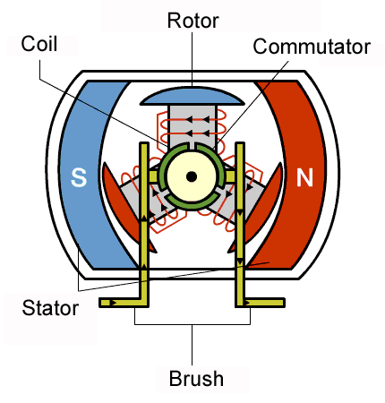

# Brushed DC Motors and Servo Motors

***
 

## Overview 
This lecture shows few examples usage of two main ***D**irect **C**urrent* (DC) motors: the *brushed motors*  and the *servo motors*. Both require a control that passes through the use of appropriate *PWM* signals and both are widely used as actuators when controlling embedded systems.

* [Brush DC Motors (*BDCM*)](#Motori-CC-a-Spazzole-(BDCM))
  * [H bridge // L9110](#Ponte-H-//-L9110)
  * [Control of a brush motor](#Controllo-di-un-motore-a-spazzole)
* [Servo Motors](#Servomotori)
  * [Control of a servomotor](#Controllo-di-un-servomotore)

  

## Brushed DC Motors (*BDCM*)

They are used in many industrial applications, in contexts related to the automotive world and also in many applications related to the world of robotics; not to mention the various uses in everyday devices. These are actuators that, in general, are found at a relatively low price and are easy to use even in embedded control systems.

These motors are operated by means of two terminals. A potential difference is applied in order move the *rotor*, which will rotate at a speed proportional to the applied voltage. The direction of rotation depends on the polarity of the voltage. For more details and insights regarding the equations that define these *electrical machines*, please refer to specific texts.

In applications where it is necessary to control a DC motor, the parameter which is mainly concerned is the speed of the motor and, if given, the direction of rotation. For simple applications it is sufficient to supply an adequate voltage to the motor which, as known, is directly proportional to its rotation speed. For the development of more efficient applications, in which perhaps it is also necessary to vary the direction of rotation and a more accurate speed control is required, *PWM* signals are used. Before reaching the motor these signals are adjusted and elaborated by an appropriate  dedicated circuits called *driver*. Obviously, the *PWM* signal will be used by varying its *duty-cycle* so as to vary the average value of the signal arriving at the motor.

In their basic form, these circuits are composed of at least one resistor and a transistor, but to avoid overheating problems and improve the system's capabilities, a particular *driver* is generally used which consists of 4 transistors suitably connected to each othe and with the engine itself. This circuit, due to its graphic schematization, is called *H-bridge* (*H-bridge* or *full-bridge*).

  

Depending on which transistors are active, different "paths" are created for the current, allowing in a simplified way, the polarity inversion of the voltage across the motor, placed in the center.

The control of the motor therefore passes through the generation of the signals that control the transistors of the *driver*, the *H bridge*.

#### H bridge // L9110
We take as an example, the *H bridge* [**L9110**](docs/L9110-datasheet.pdf), an integrated cicuit which realizes the *driver* in question and allows the control of motors that work at different voltage levels, from 2.5V to 12V. In the following it will be used encapsulated inside a module that provides, in a simplified way, the possibility of connection with motors and microcontroller. In particular, this module allows the connection and control of two motors simultaneously: each motor is managed by two control pins.

 
  

Generally, the pins are labelled according to their usage:

| Pin |Description|
| :-: | :-:            |
|B-IA	|Motor B Input A |
|B-IB	|Motor B Input B |
|GND	|Ground          |
|VCC	|Voltage  2.5-12V|
|A-IA	|Motor A Input A |
|A-IB	|Motor A Input B |

The relationship between the configuration of the module inputs and the output result, on the pins of the *H bridge*, is direct. Expressed in terms of logical voltage values ( low (**L**) and high (**H**)) this relation is illustrated in the following table:.

|Input (IA // IB) |	Output (OA // OB) | Resulting motor action|
| :-: |  :-:  | :-: |
|L // L	| L // L	|Off| 
|H // L	| H	// L	|Forward| 
|L // H	| L	// H	|Reverse| 
|H // H	| H	// H	|Off| 

#### :dart: PWM control signal
The speed of the motor is directly proportional to the voltage applied to its pins. Working with a *PWM* signal, the voltage to refer to will be the average value of the signal, which corresponds to the *DC component* of the signal. It is therefore important to choose the *PWM* signal so that its frequency is high enough and has a higher value than the *cut-off frequency* of the system describing the motor.

If the frequency of the *PWM* signal is above the *cut-off frequency* threshold, then it will be "ignored" by the system and the only component that will be taken into consideration will be the DC component, which corresponds precisely to the average value of the *PWM* signal.

Only by choosing an adequate frequency for the *PWM* signal will it be possible to control the motor properly, without it undergoing sudden acceleration changes. Ultimately, the parameter to know is the *motor time constant*, which is generally a parameter that can be found on the datasheet of the motor you are using.

### Brushed DC Motor Control
An example of control of a *BDCM*, via *H bridge*, can be achieved with *STM32Cube* by controlling the motor speed via a potentiometer: this is read via *ADC* and the input value is mapped on a scale of 0-100, which will correspond to the *duty-cyle* value of the *PWM* signal that will control one of the two inputs of the *H bridge H*.

  

It is important to make sure that the frequency of the *PWM* signal is high enough, in this case a high frequency is kept in order to avoid problems with the motor used in the examples (whose time constant is not known); if the datasheet of the motor is available, refer to the value of the *mechanical time constant* (or other if specified) to determine the value of the period of the *PWM* signal.

In this case, with the parameters used, a signal is obtained that has a period of 0.1ms, more than sufficient for correct motor control.

  

An stm32 project (`bdcm_motor_stm32`) is also available where a PWM signal of $2 kHz$ was used. The PWM duty cycle is changed in accordance to the values read from a potentiometer  

## Servo Motors

A *servo motor* belongs to the family of "rotary actuators" and can be efficiently controlled in order to move with a precise speed or to achieve desired angular configuration. These are devices widely used in the world of robotics (certainly in robotic arms) and in general in contexts involving industrial automation, where precise position controls are important.

Internally it is composed of a series of electro-mechanical devices that determine a closed loop system, this allows the servomotor to be, to some extent, already internally controlled. In addition, a gear wheel system allows it to provide more torque than a simple brush motor.

  

From an external point of view it is managed through a *PWM* signal, of which, this time, the period is also important; as long as this signal is supplied to the motor, it will maintain a precise angular position.

Generally, for many servomotors a *PWM* signal with a period of 20ms (50Hz) is used and the variation of the *duty cycle* determines the variation of the motor rod angle, from 0 to 180 degrees (usually) . The specific *duty cycle* values vary from engine to engine, generally we have:
* *duty cycle 1ms* : 0 degrees
* *duty cycle 2ms* : 180 degrees

Any other duty cycle value between these two will result in an angle between 0 and 180 degrees linearly.

  

### Servo Motors Control
Below is reported an example of control of a servomotor of the [Tower Pro, model SG90](http://www.towerpro.com.tw/product/sg90-7): a small servomotor that can rotate the axis about 180 degrees, but not able to develop a significant torque (1.80 Kg/cm). Information about the command signal and connection can be found on the [datasheet](docs/sg90-datasheet.pdf).

  

To write a program that manages the motion of the servomotor it is important to keep in mind the relationship for which:

`DutyCycle = (MAX – MIN) * DESIRED_DEGREES / 180 + MIN`

in which `MAX` is 2ms and `MIN` is 1ms;

Based on this, it will be possible to map a desired value in degrees to a value in *ms* to assign as the *duty cycle* of the *PWM* signal, which in any case must have a period of 50Hz.

The configuration of the *timer* for the generation of the *PWM* signal is done taking into consideration the formula seen in the Timer section.

After having set the system *clock* at 84MHz, choose:
* `Prescalar` : 8400
* `Counter` : 200

in order to obtain a 50Hz (20ms) period *PWM* signal

With this configuration, the *duty cycle* value  will have to vary approximately between 10 and 20 to actually be between 1ms and 2ms. However, it will be necessary to carry out empirical tests to determine the minimum and maximum angle of the motor, which often do not fully correspond to what is reported on the datasheets.