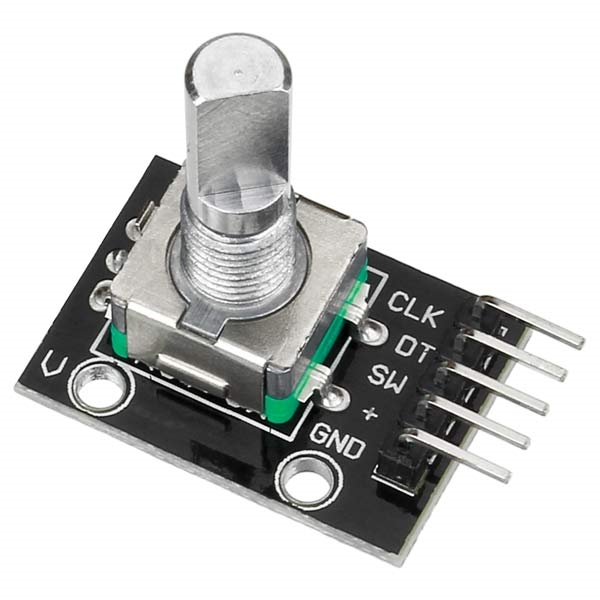
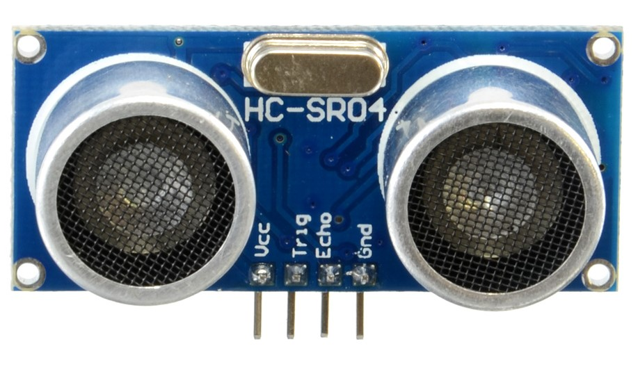

# Sensors
### Sensors for Embedded Control

***
</br>


## Overview 
Below there are some examples of use of some sensors that can be used in an Embedded Control System.

* [Rotary Encoder](#Rotary-Encoder)
* [Ultrasonic Proximity Sensor](#Sensore-di-Prossimità-ad-Ultrasuoni)


</br></br>

## Rotary Encoder

The module used is a **digital rotary encoder**: an electro-mechanical device that transmits, through digital signals, information related to the motion of a shaft. 

<p align="center">
  
</p>


The digital output therefore provides information about the movement of the metal rod; information that can be processed to determine, generally, a rotational speed, a position, or a traveled distance. The interface of the encoder used in this lecture is reported below

<p align="center">
  
</p>

Encoders, in different forms, are used in many applications involving industrial control or robotics, they are also found in remote control systems or laboratory equipment such as rheometers.

The device being analyzed is an incremental rotary encoder that uses two output signals to determine the movement of the metal rod, these are called "in quadrature" since they are out of phase by 90 degrees.

<p align="center">
  
</p>


Based on the analysis of the two outputs, it is possible to determine the direction of rotation and, by counting the occurrences of the signals, determine the rotation speed or position.

For a device of this type, many ST microcontrollers provide direct support via the *timers*, as also reported in the *reference manual*:


> **TIM1 & TIM8** timer features include: 
> * Supports incremental (quadrature) encoder and Hall-sensor circuitry for positioning
purposes

In this mode, the *timer* is used as if the encoder were for him an external clock source; the counter (`CNT`) therefore varies between 0 and the value of *auto-reload* (`ARR`), both increasing and decreasing, and the mode works with the logic called "X4".

With this mode it is therefore possible to obtain information about the position of the sensor, from which speed or acceleration can also be calculated, useful parameters if the sensor is used for operations concerning the speed regulation of an engine.

<p align="center">
  
</p>

The use of this module is done with *STM32Cube*. The encoder used performs 20 steps to perform a complete rotation, given the operating mode of the *encoder mode* it is necessary to choose the `counter` value appropriately. The other settings remain at their defaults, except for `Encoder Mode`, which is used to make the counting occur on both channels of the *timer*.

In order to set the timer, in this case the advanced timer `TIM1`, it is useful to analyze the timer block diagram

<p align="center">
  
</p>

we need to connect the channel 1 and channel 2 to `TI1` and `TI2`. This signals are then filtered and elaborated into the `TI1FP1` and `TI1FP2` that are used within the encoder mode block to count for each tick.
The configuration of the timer is given below
```c
void TIM1_encoder_setup() {
	/* GPIO SetUp (PA8 -> TIM1_CH1) */
	RCC->AHB1ENR |= (1 << RCC_AHB1ENR_GPIOAEN_Pos);		// Enable GPIO6
	GPIOA->MODER |= (2 << 16); 							// Alternate function mode
	GPIOA->AFR[1] |= (1 << 0); 							// Alternate function n1 for PA8 (TIM1 CH1)
	GPIOA->OSPEEDR 	|= (3 << 16);  						// High Speed for PIN PA6

	/* GPIO SetUp (PA9 -> TIM1_CH2) */
	GPIOA->MODER |= (2 << 18); 							// Alternate function mode
	GPIOA->AFR[1] |= (1 << 4); 							// Alternate function n1 for PA8 (TIM1 CH1)
	GPIOA->OSPEEDR 	|= (3 << 18);  						// High Speed for PIN PA6

	/* TIM1 SetUp */
	RCC->APB2ENR |= (1 << RCC_APB2ENR_TIM1EN_Pos); 		// Clock to TIM1

	/* CR1 Configuration */
	TIM1->CR1 &= ~(1 << TIM_CR1_UDIS_Pos); 		// Update event enabled
	TIM1->CR1 &= ~(1 << TIM_CR1_URS_Pos);		// Update event generated by any source
	TIM1->CR1 |= (1 << TIM_CR1_ARPE_Pos); 		// Auto reload preload enabled

	/* TIM1 CH1 to TI1 */
	TIM1->CCMR1 |= (0x01 << TIM_CCMR1_CC1S_Pos); 	// TIM1_CH1 configured as input TI1 mapped to CH1
	TIM1->CCER  &= ~(1 << TIM_CCER_CC1P_Pos); 		// I1FP1 non-inverted, TI1FP1 = TI1
	TIM1->CCER  &= ~(1 << TIM_CCER_CC1NP_Pos); 		// I1FP1 non-inverted, TI1FP1 = TI1
	TIM1->CCMR1  &= ~(0x0F << TIM_CCMR1_IC1F_Pos); 	// I1FP1 non-inverted, TI1FP1 = TI1

	/* TIM1 CH2 to TI2 */
	TIM1->CCMR1 |= (0x01 << TIM_CCMR1_CC2S_Pos); 	// TIM1_CH1 configured as input TI1 mapped to CH1
	TIM1->CCER  &= ~(1 << TIM_CCER_CC2P_Pos); 		// I1FP1 non-inverted, TI1FP1 = TI1
	TIM1->CCER  &= ~(1 << TIM_CCER_CC2NP_Pos); 		// I1FP1 non-inverted, TI1FP1 = TI1
	TIM1->CCMR1  &= ~(0x0F << TIM_CCMR1_IC2F_Pos); 	// I1FP1 non-inverted, TI1FP1 = TI1

	TIM1->ARR = 1000;


	// Both inputs are active on both rising and falling edges
	TIM1->SMCR |= (3 << TIM_SMCR_SMS_Pos);

	TIM1->EGR |= (1 << TIM_EGR_UG_Pos); 		// Fire an update event to update shadow registers
	TIM1->CR1 |= (1 << TIM_CR1_CEN_Pos);
}
```

## Ultrasonic Proximity Sensor 

Sensors of this type generally use an ultrasonic signal, with a frequency of 40 KHz, to determine the distance from what they have in front of them. The transmitted wave is reflected by the obstacle and goes back to the sensor which determines the time of flight of the wave and, knowing the speed of sound in the air, allows the calculation of the distance from the obstacle.

The module used is *HC-SR04*, which allows you to determine the distance of an obstacle between 2cm and 4m, with a resolution that can reach 3mm. It is a module that contains both transmitter and receiver, located on the same axis.

<p align="center">
  
</p>

Every detail can be found on its datasheet [datasheet](docs/HCSR04-datasheet.pdf), from which the particular logic with which it must be used is also extracted. The steps to be taken to determine the distance are in fact:


* Keep the pin `TRIG` HIGH for 10 μs
* Wait for the 8 ultrasound cycles at 40 KHz without doing anything
* When the signal starts to go back, intercept the high value of the `ECHO` pin and calculate the time it remains high
* Determine the distance using the duration (in μs) of the high `ECHO` signal and the speed of sound in air
* Wait at least 60 ms before taking a new measurement

<p align="center">
  
</p>

Note the speed of sound in air (343.1m/s at 20° or 0.0343cm/μs) the distance traveled by the wave is determined according to a relationship that combines time and speed.
So from

where **t** is the time of flight of the wave in air, which corresponds to the time for which the `ECHO` signal remains high. However, it must be kept in mind that the wave travels the same distance twice, when emitted towards the object and after reflection towards the sensor; it is therefore necessary to divide the calculated distance by two. Definitely:

<p align="center">
  
</p>

In the *CubeMX* interface you configure the *timer* so that its increment allows you to keep track of the passage of time in microseconds. Once the system clock is set at 84MHz, the prescaling at 84 is chosen in order to have a clock that varies at 1Mhz; the maximum value of the counter is also chosen: 0xffff (65535).


To compute the time duration in microseconds, a specific *delay* function is implemented:

```c
void delay_micro_s(uint16_t delay) {
	TIM6->ARR = delay - 1;
	TIM6->CR1 |= (1 << TIM_CR1_CEN_Pos);
	while(!time_elapsed) {};
	time_elapsed = 0;
}
```

Which brings the *timer* counter to 0 and the `ARR` to the desired $\mu s$ to wait. The timer is configured in order to count for $\mu s$ and fire and *update event* when the desired amount of $\mu s$ has passed. The timer configuration (with an APB1 clock of $90 MHz$) in given below
```c
void TIM6_basic_setup() {

	RCC->APB1ENR |= (1 << RCC_APB1ENR_TIM6EN_Pos); 		// Clock to TIM6

	TIM6->CR1 &= ~(1 << TIM_CR1_UDIS_Pos); 		// Update event enable
	TIM6->CR1 |= (1 << TIM_CR1_URS_Pos);		// Update event generated only by overflow/underflow
	TIM6->PSC = 90 - 1; 						// CNT incremented every nanoseconds
	
	TIM6->DIER |= (1 << TIM_DIER_UIE_Pos); 		// Trigger an interrupt every update event
	NVIC_EnableIRQ(TIM6_DAC_IRQn);				// Enable interrupt for TIM6
	NVIC_SetPriority(TIM6_DAC_IRQn, 0); 		// Set Priority
}
```
The **ISR** is given below
```c
void TIM6_DAC_IRQHandler() {
	if((TIM6->SR >> TIM_SR_UIF_Pos) & 0x01) {
		NVIC_ClearPendingIRQ(TIM6_DAC_IRQn);
		time_elapsed = 1;
		TIM6->CR1 &= ~(1 << TIM_CR1_CEN_Pos);
		TIM6->SR &= ~(1 << TIM_SR_UIF_Pos);
	}
}
```

Using the `delay_micro_s(...)` function it is possible to write a method that commands the reading from the ultrasonic sensor:

The distance in the main program life cycle is then determined from the `echo_time` value.
```c
float meas_dist() {
	clear_triger(); 	// keep trigger low
	delay_micro_s(3);	// for at least 3 mu_s

	set_triger();		// set trigger high
	delay_micro_s(10);	// for at least 10 mu_s
	clear_triger();		// clear trigger to start ultrasonic burst transmission

	while(!measure_collected);	// wait for measurement to be collected (look EXTI ISR)
	return 0.5*0.000343*measure;				// return measurement (twice speed of sound times echo rise time)
}
```
It is possible to see the measured distance in a serial terminal by properly configuring a `UART` interface. The values will change by placing it in front of an obstacle at a variable distance. Pay attention to let at least 60ms pass between one measurement and the next, as specified in the datasheet.
